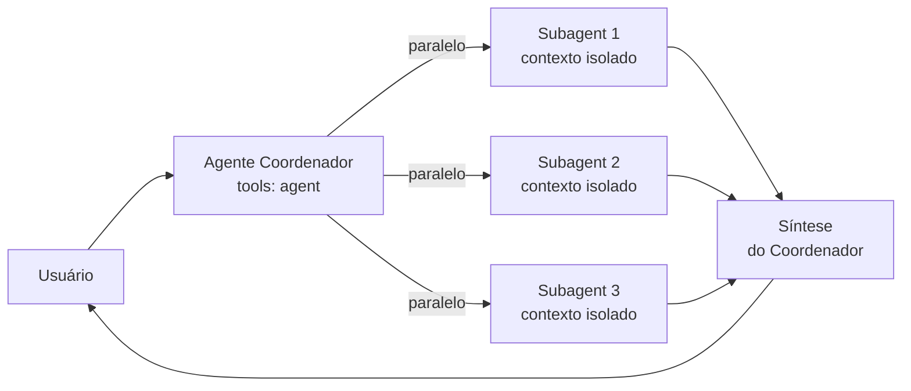

# 🤖 Agents — Luizalabs

Índice de agentes especializados. Cada agente tem uma persona, objetivos e capabilities próprias.

> **VS Code 1.97+ — Subagents**: Agentes com `tools: ['agent']` podem delegar tarefas a subagents especializados que rodam em janelas de contexto isoladas e retornam apenas o resultado final, reduzindo o consumo de tokens e mantendo o contexto do agente principal limpo.

---

## 🎯 Agentes Coordenadores (Orquestradores)

Estes agentes usam **subagents em paralelo** para análises multi-perspectiva. São o ponto de entrada recomendado para tarefas complexas.

| Agente | Papel | Subagents Utilizados |
|---|---|---|
| [feature-builder](./feature-builder.md) | Coordena entrega end-to-end de features (Plan → TDD → Implement → Review) | `software-architect`, `quality-engineer`, `secops-agent`, `code-reviewer`, `platform-engineer` |
| [code-reviewer](./code-reviewer.md) | Review multi-perspectiva paralelo antes de merge | `secops-agent`, `quality-engineer`, `software-architect`, `refactoring-agent` |
| [padrao-labs-agent](./padrao-labs-agent.md) | Audita 100% de aderência ao Padrão Labs | `secops-agent`, `quality-engineer`, `platform-engineer`, `software-architect` |
| [software-architect](./software-architect.md) | Arquitetura, ADRs, Design Docs (C4), débito técnico | `quality-engineer`, `secops-agent` |

---

## 🔧 Agentes Especialistas (Workers)

Agentes focados, usados diretamente ou invocados como subagents pelos coordenadores.

| Agente | Especialidade | `user-invokable` |
|---|---|---|
| [quality-engineer](./quality-engineer.md) | Cobertura ≥90%, SonarQube, pytest/jest, métricas DORA | ✅ |
| [secops-agent](./secops-agent.md) | SecOps, segredos, WAF, conformidade, Zero Trust | ✅ |
| [refactoring-agent](./refactoring-agent.md) | SOLID, DRY, KISS, YAGNI, Clean Code | ✅ |
| [platform-engineer](./platform-engineer.md) | IaC (Terraform), CLIs, templates CI/CD, Helm Charts | ✅ |
| [terminal-operator](./terminal-operator.md) | DevOps, K8s, GCP/MGC, Docker, Git avançado, CI-Knife | ✅ |
| [frontend-expert](./frontend-expert.md) | React/Vite/TypeScript, Zustand, acessibilidade WCAG, Core Web Vitals | ✅ |
| [mobile-engineer](./mobile-engineer.md) | React Native, Android, iOS, performance 60fps | ✅ |

---

## 🔗 Como Subagents Funcionam (VS Code 1.97+)

**Propriedades de frontmatter relevantes:**

| Propriedade | Padrão | Descrição |
|---|---|---|
| `tools: ['agent', ...]` | — | Habilita o agente a invocar subagents |
| `user-invokable` | `true` | Exibir o agente no dropdown do chat |
| `disable-model-invocation` | `false` | Impede outros agentes de usar este como subagent |
| `agents: [...]` | `*` (todos) | Restringe quais subagents este coordenador pode usar |

---

## Referências Rápidas

- **Skill de configuração do VS Code + Copilot**: `.agents/skills/configuring-vscode-copilot/SKILL.md`
- **Configuração Netskope (SSL)**: `.agents/skills/configuring-netskope/SKILL.md`
- **Regras e Padrões**: `.agents/rules/index.md`
- **Documentação Subagents (VS Code)**: https://code.visualstudio.com/docs/copilot/agents/subagents
