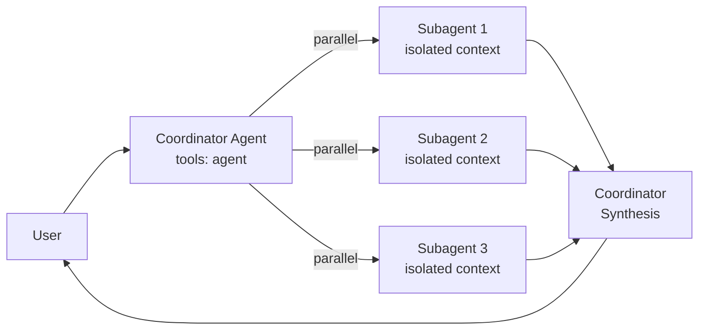

# 🤖 Agents

Index of specialized agents. Each agent has its own persona, objectives, and capabilities.

> **VS Code 1.97+ — Subagents**: Agents with `tools: ['agent']` can delegate tasks to specialized subagents running in isolated context windows and returning only the final result, reducing token consumption and keeping the main agent context clean.

---

## 🎯 Active Agents

Simplified catalog by high-value function and technology context.

| Agent | Role |
|---|---|
| [principal-engineer](./principal-engineer.agent.md) | Principal-level engineering guidance, architecture review, SOLID patterns, technical leadership |
| [design-doc](./design-doc.agent.md) | Architecture, ADR/RFC, Design Docs, evolution strategy |
| [code-reviewer](./code-reviewer.agent.md) | Principal-level technical review for security, architecture, quality, design patterns (Repository Standard) |
| [secops-agent](./secops-agent.agent.md) | Security, secrets, compliance, and defensive controls |
| [terminal-operator](./terminal-operator.agent.md) | Infrastructure operations and safe shell execution |
| [python-engineer](./python-engineer.agent.md) | Python/FastAPI engineering for production |
| [nodejs-engineer](./nodejs-engineer.agent.md) | Node.js backend/tooling engineering for production |
| [dotnet-engineer](./dotnet-engineer.agent.md) | C#/.NET engineering with async patterns, SOLID, DI, and testing |
| [frontend-expert](./frontend-expert.agent.md) | Web UI/UX, accessibility, React 19.2, and frontend performance |
| [mobile-engineer](./mobile-engineer.agent.md) | Cross-platform mobile engineering and app store publishing |

---

## 🔗 How Subagents Work (VS Code 1.97+)

**Relevant frontmatter properties:**

| Property | Default | Description |
|---|---|---|
| `tools: ['agent', ...]` | — | Enables agent to invoke subagents |
| `user-invocable` | `true` | Show agent in chat dropdown |
| `disable-model-invocation` | `false` | Prevent other agents from using this as subagent |
| `agents: [...]` | `*` (all) | Restrict which subagents this coordinator can use |

---

## Quick References

- **VS Code + Copilot configuration skill**: `.agents/skills/configuring-vscode-copilot/SKILL.md`
- **Netskope configuration (SSL)**: `.agents/skills/configuring-netskope/SKILL.md`
- **Rules and standards**: `.agents/rules/index.md`
- **Subagents documentation (VS Code)**: https://code.visualstudio.com/docs/copilot/agents/subagents

