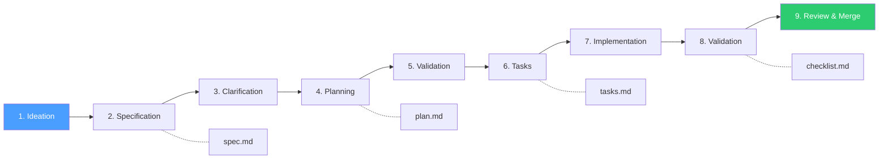

# Spec-Driven Development for Padrao-Labs-Agents

This guide explains how to use Specification-Driven Development (SDD) to build skills, agents, rules, hooks, and workflows for the Luizalabs catalog. This guide is **agent-agnostic** — works with Antigravity, Gemini CLI, Copilot, Claude, Cursor, and other AI coding assistants.

## Quick Start

### 1. Understand the Constitution

Start by reading the project constitution:
```bash
cat .specify/memory/constitution.md
```

This document outlines 5 core principles that guide all development in this project:
1. **Skill-First Architecture** - Every feature is a standalone, reusable module
2. **Multi-Agent Compatibility** - Works across Gemini, Copilot, Claude, etc.
3. **Specification-First Development** - Write specs before code
4. **Markdown-First Documentation** - All artifacts use Markdown
5. **Test-Before-Merge Imperative** - Tests required before merging

### 2. Create Specification for Your Feature

Use the automation script:
```bash
# Create feature directory and copy all templates
pnpm spec:init [feature-name]
```

This creates:
- `.specify/specs/[feature-name]/spec.md` — Requirements
- `.specify/specs/[feature-name]/plan.md` — Technical plan
- `.specify/specs/[feature-name]/tasks.md` — Task breakdown
- `.specify/specs/[feature-name]/checklist.md` — Validation checklist

**Key sections to complete** in `spec.md`:
- Header (feature name, type, platforms)
- User Scenarios (P1, P2, P3 user stories)
- Requirements (functional and non-functional)
- Testing Strategy (unit, integration, manual)
- Contracts (interfaces, inputs/outputs)
- Success Criteria (measurable outcomes)

### 3. Use Your AI Agent to Clarify & Plan

Ask your AI agent to follow the SDD workflow:
```
Follow the workflow in .agent/workflows/sdd-new-feature.md
for the feature [feature-name]
```

Or use individual steps:
```
Review the spec at .specify/specs/[feature-name]/spec.md
and clarify any [NEEDS CLARIFICATION] items
```

Then create a plan:
```
Review the spec and create a technical plan in
.specify/specs/[feature-name]/plan.md following the template
```

### 4. Break Into Tasks

Ask your agent:
```
Create a task breakdown in .specify/specs/[feature-name]/tasks.md
with Foundation, P1, P2, and Polish phases
```

### 5. Implement Following Tasks

Create feature branch:
```bash
git checkout -b feature/[feature-name]
```

Implement each task — ask your agent:
```
Implement TASK-001 from .specify/specs/[feature-name]/tasks.md
```

After each task:
```bash
# Run tests
pnpm test:run

# Commit progress
git add .
git commit -m "[TASK-001] Brief description of what was implemented"
```

After each task:
```bash
# Run tests
pnpm test:run

# Commit progress
git add .
git commit -m "[TASK-001] Brief description of what was implemented"
```

### 6. Validate & Merge

Run validation:
```bash
# Validate + show status dashboard
pnpm spec:check
```

Verify all items before creating merge request:
```bash
# Run full test suite
pnpm test:run

# Validate documentation builds
pnpm docs:build

# Lint markdown
pnpm lint:md

# Regenerate catalog
node src/loader.js
```

Check the status dashboard:
```bash
pnpm spec:check
```

Create merge request and request review.

---

## Project Structure

```
.
├── .specify/                          # Specification-Driven Development heart
│   ├── memory/
│   │   └── constitution.md            # Project principles and governance
│   ├── specs/
│   │   ├── docker-troubleshooting/    # Example feature spec directory
│   │   │   └── EXAMPLE-spec.md        # Completed specification example
│   │   └── [feature-name]/            # Create one per new feature
│   │       ├── spec.md                # Requirements and user scenarios
│   │       ├── plan.md                # Technical implementation plan
│   │       ├── tasks.md               # Task breakdown with dependencies
│   │       └── checklist.md           # Validation checklist
│   ├── templates/
│   │   ├── spec-template.md           # Template for new specifications
│   │   ├── plan-template.md           # Template for new plans
│   │   ├── tasks-template.md          # Template for task breakdowns
│   │   └── checklist-template.md      # Template for validation checklists
│   ├── commands/
│   │   └── slash-commands-guide.md    # AI agent commands reference
│   └── scripts/
│       ├── init-spec.sh               # Scaffold new feature spec
│       ├── validate-spec.sh           # Lint/validate specs
│       └── spec-status.sh             # Status dashboard
├── .agent/                           # Actual skills, agents, rules
│   ├── skills/
│   ├── agents/
│   ├── rules/
│   ├── hooks/
│   └── workflows/
│       ├── sdd-new-feature.md         # Complete SDD feature workflow
│       ├── sdd-validate.md            # Pre-merge validation workflow
│       └── sdd-review.md              # Spec/plan review workflow
└── [rest of project...]
```

---

## SDD Flow Diagram



## Automation Scripts

| Command | Description |
|---------|-------------|
| `pnpm spec:init <name>` | Cria spec completa a partir dos templates |
| `pnpm spec:check` | Valida specs + mostra dashboard de status |
| `pnpm spec:check <name>` | Valida uma spec específica |

## Agent Workflows

Workflows que qualquer AI agent pode seguir em `.agent/workflows/`:

| Workflow | Descrição |
|----------|-----------|
| `sdd-new-feature.md` | Fluxo completo para criar nova feature |
| `sdd-validate.md` | Validação pré-merge com checklist |
| `sdd-review.md` | Review de spec/plan contra constitution |

---

## Workflow: From Idea to Production

### Phase 1: Ideation (Human)
- Identify a problem to solve
- Get rough approval from team

### Phase 2: Specification (AI + Human)
**File**: `.specify/specs/[feature]/spec.md`

Using your AI agent (Antigravity, Gemini, Copilot, Claude, Cursor, etc.):
```
Follow the workflow in .agent/workflows/sdd-new-feature.md
```

Or use the template directly:
```bash
pnpm spec:init [feature-name]
```

The spec includes:
- User scenarios and acceptance criteria
- Functional and non-functional requirements
- Key entities and data models
- Success criteria
- Out of scope items

**What makes good specs**:
- Clear user scenarios with Given/When/Then format
- Explicit success criteria (measurable)
- Marked clarifications with `[NEEDS CLARIFICATION]`
- No implementation details (focus on "what" and "why", not "how")

### Phase 3: Clarification (AI)
**Input**: Spec with `[NEEDS CLARIFICATION]` markers

Ask your agent:
```
Review .specify/specs/[feature]/spec.md and resolve
all [NEEDS CLARIFICATION] items
```

Output: Updated spec with ambiguities resolved

### Phase 4: Planning (AI)
**File**: `.specify/specs/[feature]/plan.md`

Ask your agent:
```
Create a technical plan from the spec in
.specify/specs/[feature]/plan.md following the plan template
```

The plan includes:
- Technology stack and dependencies
- Architecture and design patterns
- Data model details
- Integration points
- Testing strategy
- Constitutional compliance check
- Estimated effort breakdown

### Phase 5: Validation (AI)
**Check**: Does the plan accord with constitution?

Ask your agent:
```
Follow the workflow in .agent/workflows/sdd-review.md
for the feature [feature-name]
```

Output: Risk assessment and improvements

### Phase 6: Task Breakdown (AI)
**File**: `.specify/specs/[feature]/tasks.md`

Ask your agent:
```
Create a task breakdown in .specify/specs/[feature]/tasks.md
following the tasks template
```

The task list includes:
- 4+ phases: Foundation, P1, P2, Polish
- Individual tasks with:
  - Task ID (TASK-001, TASK-002, etc.)
  - Clear description of what to implement
  - File paths (where code goes)
  - Dependencies (what must complete first)
  - Parallelizable markers `[P]`
- Phase checkpoints (verify before proceeding)
- Status tracking table

### Phase 7: Implementation (Human + AI)
**Method**: Execute one task at a time

For each task:
```bash
# Check out feature branch
git checkout feature/[feature-name]

# Ask your agent to implement the task
# "Implement TASK-006 from .specify/specs/[feature]/tasks.md"

# Verify with tests
pnpm test:run

# Commit
git add .
git commit -m "[TASK-006] [Description]"
```

**Important**:
- Do NOT skip tests
- Do NOT implement multiple tasks at once
- Do NOT deviate from the approved plan without explanation
- Run `pnpm test:run` after each task

### Phase 8: Validation (Human)
**File**: `.specify/specs/[feature]/checklist.md`

Run validation:
```bash
pnpm spec:check
# Or follow .agent/workflows/sdd-validate.md
```

Verify all items:
- [ ] All user scenarios from P1 work
- [ ] Test coverage > 80%
- [ ] Documentation complete with examples
- [ ] Works on all required platforms
- [ ] Catalog entry created
- [ ] Build passes (`pnpm docs:build`)
- [ ] Constitution compliance verified

### Phase 9: Review & Merge (Human)

```bash
# Create pull request
git push origin feature/[feature-name]

# On GitHub/GitLab:
# - Title: [Feature] [Short description]
# - Description: Reference the spec
# - Link spec document in PR
# - Ensure CI/CD checks pass
# - Get 1+ maintainer approval
```

After approval:
```bash
git checkout main
git merge feature/[feature-name]
git push origin main

# CI/CD automatically builds and deploys docs
```

---

## Spec Templates

All templates are in `.specify/templates/`:

### spec-template.md
Use for defining requirements and user stories.

Key sections:
- **User Scenarios**: P1, P2, P3 user stories with acceptance criteria
- **Requirements**: Functional, non-functional, security, performance
- **Success Criteria**: Measurable outcomes
- **Out of Scope**: What's NOT included

### plan-template.md
Use for technical design after spec is approved.

Key sections:
- **Summary**: Technology decisions and rationale
- **Technical Context**: Stack, dependencies, constraints
- **Architecture**: Project structure and design patterns
- **Data Model**: Entity definitions
- **Constitution Check**: Validation against principles
- **Testing Strategy**: Unit, integration, E2E approaches

### tasks-template.md
Use for detailed task breakdown with dependencies.

Key sections:
- **Task Format**: How to write actionable tasks
- **Phases**: Foundation → P1 → P2 → Polish → Review
- **Dependencies**: What must complete first
- **Checkpoints**: Verification gates between phases
- **Status Tracking**: Progress table

---

## Example: Creating a New Skill

### Step 1: Get Feature Idea Approved
> "Build a skill that analyzes Docker errors"

### Step 2: Create Specification

```bash
mkdir -p .specify/specs/docker-troubleshooting
cp .specify/templates/spec-template.md .specify/specs/docker-troubleshooting/spec.md
```

Edit `spec.md` with:
- Feature: Docker Troubleshooting Skill
- P1 Scenarios: Error analysis, log analysis
- Requirements: Parse Docker errors, provide suggestions
- Success Criteria: > 80% accuracy, all platforms

Reference: See `.specify/specs/docker-troubleshooting/EXAMPLE-spec.md` for a complete example.

### Step 3: Clarify with AI

```
/speckit.clarify Review what types of Docker errors we should handle
```

Resolve questions about scope, accuracy targets, etc.

### Step 4: Create Technical Plan

```
/speckit.plan Create plan for Docker skill that:
- Uses TypeScript
- Integrates with existing CLI installer
- Validates against constitutional principles
```

### Step 5: Generate Tasks

```
/speckit.tasks Create task breakdown with phases and dependencies
```

### Step 6: Create Feature Branch and Implement

```bash
git checkout -b feature/docker-troubleshooting-skill

# Implement TASK-001, TASK-002, ... TASK-026
# Running tests after each task
```

### Step 7: Validate Everything

```bash
# Run tests
pnpm test:run

# Build docs
pnpm docs:build

# Lint markdown
pnpm lint:md

# Regenerate catalog
node src/loader.js

# Create checklist
/speckit.checklist
```

### Step 8: Create Pull Request

```bash
git push origin feature/docker-troubleshooting-skill
# Create PR on GitHub/GitLab
```

---

## Best Practices

### 1. Specifications
- **Be specific**: "Allow users to diagnose container failures" is vague
- **Better**: "Parse Docker error messages and provide 3-5 specific troubleshooting steps"
- **Use Given/When/Then**: Makes acceptance criteria testable
- **Mark unknowns**: Use `[NEEDS CLARIFICATION]` for anything unclear

### 2. Plans
- **Validate early**: Use `/speckit.analyze` before starting implementation
- **Be realistic**: Account for testing, documentation, code review time
- **Check constitution**: Validate plan aligns with 5 core principles
- **Plan for failure**: Include contingency tasks if approach doesn't work

### 3. Tasks
- **Make them small**: Each task should take 1-4 hours maximum
- **Be specific about files**: Include exact file paths where code goes
- **Define dependencies**: Enable parallel work where possible
- **Add test requirements**: Each task must include tests

### 4. Implementation
- **One task at a time**: Don't multitask or skip ahead
- **Test after each task**: Run `pnpm test:run` immediately after coding
- **Commit frequently**: Commit after each logical unit (each task minimum)
- **Follow conventions**: Reference existing skills for patterns

### 5. Quality Gates
Before merging, verify:
- [ ] All tests pass: `pnpm test:run`
- [ ] Build succeeds: `pnpm docs:build`
- [ ] Markdown lints: `pnpm lint:md`
- [ ] Catalog regenerated: `node src/loader.js`
- [ ] Documentation complete with examples
- [ ] Constitution compliance verified
- [ ] PR reviewed by 1+ maintainers

---

## Troubleshooting

### "I'm not sure if my spec is complete"
Use `/speckit.analyze` to validate it:
```
/speckit.analyze Review this spec and identify gaps
```

### "The plan seems ambiguous"
Use `/speckit.clarify` on the plan:
```
/speckit.clarify Review this plan and identify unclear technical decisions
```

### "Tests are failing during implementation"
Review the failing test and:
1. Understand what it's testing
2. Check if your implementation matches the test
3. Check if the test itself is correct per the spec
4. Add `.test.ts` files to debug

### "I'm stuck on a task"
1. Re-read the task description in tasks.md
2. Check the corresponding spec requirement
3. Review the plan's architecture section
4. Ask for clarification in a comment on the PR

### "Build fails unexpectedly"
```bash
# Rebuild catalog
node src/loader.js

# Run full build with output
pnpm docs:build

# Check for markdown syntax errors
pnpm lint:md
```

---

## Integration with AI Agents

All agents can use the SDD workflows located in `.agent/workflows/`. Simply ask your agent to follow a workflow:

### Any AI Agent
```
Follow the workflow in .agent/workflows/sdd-new-feature.md
for the feature [feature-name]
```

### Available Workflows
- **sdd-new-feature.md**: Complete flow to create a new feature
- **sdd-validate.md**: Pre-merge validation with checklist
- **sdd-review.md**: Spec/plan review against constitution

### Automation Scripts
Scripts work independently of any AI agent:
```bash
pnpm spec:init [name]    # Scaffold new spec
pnpm spec:check          # Validate + status dashboard
```

---

## FAQ

**Q: Do I have to follow spec-driven development for everything?**
A: No, but it's required for skills, agents, rules of ANY complexity. Simple documentation fixes can skip directly to code.

**Q: Can I deviate from the spec during implementation?**
A: Maybe. If you discover the spec was wrong, update it and document the deviation in the implementation plan. Get maintainer approval.

**Q: How detailed should the tasks be?**
A: Detailed enough that someone unfamiliar with the code could implement them following the task description.

**Q: What if I need to skip a task?**
A: Don't. If a task is not needed, that means the plan needs updating. Update the plan, not the implementation.

**Q: How much testing is really necessary?**
A: > 80% coverage is minimum. Aim for > 90%. Test user scenarios, edge cases, and error paths.

---

## Resources

- **Constitution**: `.specify/memory/constitution.md`
- **Command Guide**: `.specify/commands/slash-commands-guide.md`
- **Spec Template**: `.specify/templates/spec-template.md`
- **Plan Template**: `.specify/templates/plan-template.md`
- **Tasks Template**: `.specify/templates/tasks-template.md`
- **Example Spec**: `.specify/specs/docker-troubleshooting/EXAMPLE-spec.md`

---

## Getting Started Right Now

1. Read the constitution: `cat .specify/memory/constitution.md`
2. Look at the example spec: `cat .specify/specs/docker-troubleshooting/EXAMPLE-spec.md`
3. Create your feature spec: `pnpm spec:init [your-feature]`
4. Edit `.specify/specs/[your-feature]/spec.md` with your requirements
5. Ask your AI agent to follow `.agent/workflows/sdd-new-feature.md`
6. Follow the spec → plan → tasks → implement workflow

**Happy spec-driven development!**
