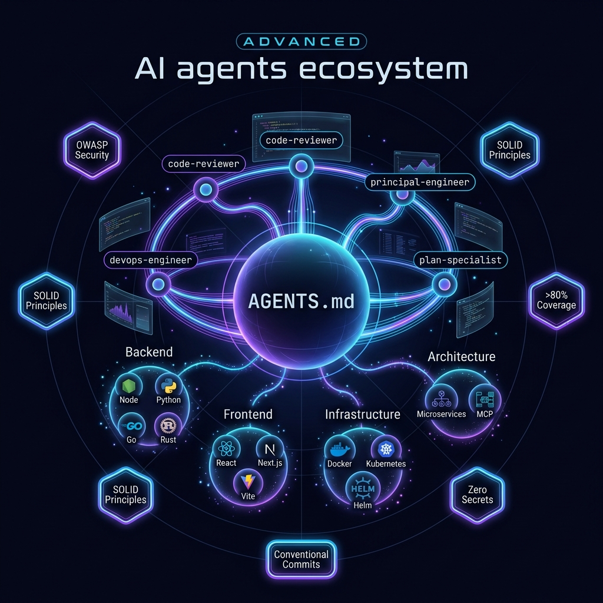

<div align="center">

# Skills



Production-grade agents, skills, prompts, and engineering rules for AI coding assistants.

[](https://code.visualstudio.com/docs/copilot/customization/agent-plugins)
[](https://docs.github.com/en/copilot/reference/copilot-cli-reference/cli-plugin-reference)
[](#license)

**Install once. Give your assistant a senior engineering playbook.**

</div>

---

## Why This Exists

Most AI coding assistants are powerful but generic. This repository turns them into a more consistent engineering partner by packaging battle-tested guidance as installable agent customizations.

It includes specialist agents, domain skills, reusable prompts, and governance rules for real software work: reviews, architecture, testing, infrastructure, frontend, mobile, backend, security, and delivery.

## At a Glance

| Capability | Count | What you get |
|---|---:|---|
| [Skills](#skills) | 58 | Domain playbooks for Node, Python, React, Docker, mobile, cloud, databases, testing, and more |
| [Agents](#agents) | 4 | Focused assistants for review, architecture, DevOps, and planning |
| [Prompts](#prompts) | 4 | Ready-to-use workflows for explain, refactor, tests, and Dockerfiles |
| [Rules](#rules) | 15 | Always-on engineering standards for security, testing, naming, privacy, and delivery |

## Highlights

- **VS Code Agent Plugin ready**: includes a root `plugin.json` and marketplace metadata.
- **Copilot CLI compatible**: install from GitHub, local path, or marketplace.
- **Claude/Gemini friendly**: keeps the `.agents/` layout for assistants that auto-discover local customizations.
- **Engineering-first defaults**: security, type safety, clean design, observability, and test discipline.
- **Practical scope**: focused instructions instead of giant generic prompts.

## Quick Install

### VS Code Agent Plugin

Install from source:

1. Enable `chat.plugins.enabled` in VS Code.
2. Run `Chat: Install Plugin From Source`.
3. Use this repository URL:

```text
https://github.com/juninmd/skills
```

For local development, register your checkout directly:

```json
{
  "chat.pluginLocations": {
    "C:\\path\\to\\skills": true
  }
}
```

Use this repository as a plugin marketplace:

```json
{
  "chat.plugins.marketplaces": [
    "juninmd/skills"
  ]
}
```

### Copilot CLI

```bash
copilot plugin install juninmd/skills
copilot plugin install /path/to/skills
```

### Claude Code / Compatible Assistants

```bash
# Clone into your project root
git clone https://github.com/juninmd/skills .agents-plugins

# Or add as a submodule
git submodule add https://github.com/juninmd/skills .agents
```

## Try It

Invoke a skill:

```text
/developing-node      # Node.js + TypeScript best practices
/mastering-docker     # Production-ready Dockerfile generation
/react-dev            # React 19+ patterns
/flutter-dev          # Flutter + Riverpod guidance
```

Invoke an agent:

```text
/code-reviewer        # Multi-perspective PR/MR review
/principal-engineer   # Architecture and system design
/devops-engineer      # CI/CD, IaC, containers, cloud
/plan-specialist      # Scope, planning, risk, quality gates
```

## Plugin Layout

```text
.
|-- plugin.json                         # VS Code / Copilot plugin manifest
|-- .github/plugin/marketplace.json     # Marketplace metadata
|-- .agents/
|   |-- agents/                         # 4 custom agents
|   |-- prompts/                        # 4 reusable prompt templates
|   |-- rules/                          # 15 governance instruction files
|   |-- skills/                         # 58 domain skills
|   `-- tools/                          # Validation scripts
`-- docs/                               # VitePress documentation
```

## Validate

```bash
pnpm install
pnpm run validate
```

The validation checks plugin metadata and all primary agent/skill files.

---

## Skills

### Backend & API

| Skill | Description |
|---|---|
| `developing-node` | Node.js 24 + TypeScript, pnpm, Biome, SWC, Vite 8 |
| `developing-python` | Modern Python: uv, ruff, pyproject.toml, PEP 723 |
| `modern-python` | Python tools ecosystem: uv, ruff, ty, prek |
| `developing-fastapi` | FastAPI + Pydantic v2, async, modular architecture |
| `developing-go` | Go modules, goroutines, clean architecture |
| `developing-rust` | Rust ownership, safety patterns, Cargo |
| `developing-dotnet` | .NET async/await, SOLID, EF Core, xUnit |
| `developing-nestjs` | NestJS modular, validation, auth |

### Frontend & UI

| Skill | Description |
|---|---|
| `react-dev` | React 19+, Server Components, useActionState, use() hook |
| `nextjs-dev` | Next.js 15+, App Router, Turbopack, uncached by default |
| `shadcn-ui` | shadcn/ui component discovery, installation, customization |
| `vite` | Vite 8 + Tailwind CSS v4 build configuration |
| `vitepress` | VitePress documentation sites with Vue |
| `frontend-design` | Production-grade distinctive UI interfaces |
| `developing-ui-ux-components` | Accessible, reusable UI components |

### Mobile

| Skill | Description |
|---|---|
| `flutter-dev` | Flutter 3 + Dart, Riverpod, GoRouter, performance patterns |
| `react-native-dev` | React Native + Expo, iOS/Android |
| `android-native-dev` | Kotlin + Jetpack Compose, Material 3 |
| `ios-application-dev` | Swift + SwiftUI for iPhone/iPad |

### Infrastructure & DevOps

| Skill | Description |
|---|---|
| `mastering-docker` | Multi-stage builds, Distroless, non-root, healthchecks |
| `managing-helm-charts` | Kubernetes Helm chart creation and optimization |
| `managing-iac` | Infrastructure as Code: Terraform, Pulumi, Ansible |
| `managing-cloud-infrastructure` | Resilient cloud architecture on AWS, GCP, and Azure |
| `managing-serverless` | Lambda, Vercel, Cloudflare Workers deployment |
| `configuring-ci-cd` | GitHub Actions and GitLab CI pipelines |
| `managing-vector-databases` | Vector DBs for similarity search and RAG |

### Code Quality & Analysis

| Skill | Description |
|---|---|
| `audit-context-building` | Ultra-granular line-by-line vulnerability analysis |
| `auditing-code` | Static analysis, linting, code smell detection |
| `validating-typescript` | Strict TypeScript type safety enforcement |
| `applying-design-principles` | Clean Code, SOLID, DRY, KISS, YAGNI refactoring |
| `karpathy-guidelines` | Avoid common LLM coding mistakes |

### Architecture & System Design

| Skill | Description |
|---|---|
| `architecting-distributed-systems` | Microservices, message queues, distributed patterns |
| `architecting-electron` | Electron apps with Main, Renderer, and Native layers |
| `developing-ai-agents` | Autonomous AI agents, tool calling, context management |
| `developing-mcp-servers` | Model Context Protocol server implementation |
| `mcp-builder` | Full MCP server build workflow |

### Build Tools & Testing

| Skill | Description |
|---|---|
| `pnpm` | pnpm package manager, workspaces, strict resolution |
| `tsdown` | Bundle TS/JS libraries with Rolldown |
| `vitest` | Vitest unit testing, Jest-compatible API |
| `developing-tooling` | CLI tools, automation scripts, utilities |

### Database & Data

| Skill | Description |
|---|---|
| `administrating-databases` | PostgreSQL and MongoDB/Redis administration |

### Git & Workflow

| Skill | Description |
|---|---|
| `git-cleanup` | Safe git branch and worktree cleanup |
| `finishing-a-development-branch` | Complete development cycle: merge, PR, cleanup |
| `using-git-worktrees` | Isolated git worktrees for parallel feature work |
| `fix-gitleaks` | Fix gitleaks CI failures and triage secrets |
| `github-triage` | Issue triage state machine with labels |

### Specialized

| Skill | Description |
|---|---|
| `implementing-accessibility` | Web accessibility standards and auditing |
| `diagnosing-networks` | DNS, HTTP, connectivity troubleshooting |
| `diagnosing-rabbitmq` | RabbitMQ queue diagnosis, consumers, DLQ |
| `firebase-apk-scanner` | APK security misconfiguration scanning |
| `using-superpowers` | Skill discovery and usage overview |
| `trailmark-summary` | Quick codebase summary: languages, entry points, graph |
| `vscode-auto-update` | Auto-update VS Code on Debian/Ubuntu |
| `caveman` | Terse response mode: substance over fluff |

---

## Agents

### `code-reviewer`

Principal-level code reviewer for PR/MR review, security auditing, architecture feedback, regression spotting, and structured review comments.

### `principal-engineer`

Architecture-focused agent for system design, ADRs, trade-off analysis, technical debt strategy, and scalability planning.

### `devops-engineer`

Infrastructure agent for CI/CD, Docker, Kubernetes, Helm, IaC, cloud platforms, and observability.

### `plan-specialist`

Planning agent for decomposition, scope definition, Mermaid diagrams, quality gates, and risk registers.

---

## Prompts

| Prompt | Trigger | Description |
|---|---|---|
| `explain` | `/explain` | Step-by-step code explanation with context and edge cases |
| `refactor` | `/refactor` | Clean Code refactoring without changing business logic |
| `generate-tests` | `/generate-tests` | Unit tests with happy paths, edge cases, and errors |
| `generate-dockerfile` | `/generate-dockerfile` | Production-ready multi-stage Dockerfiles |

---

## Rules

| Rule | Enforces |
|---|---|
| `security` | OWASP Top 10, Zod validation, no hardcoded secrets |
| `git-workflow` | Feature branches only, Conventional Commits, PR-first |
| `testing` | >80% coverage, unit + integration, meaningful assertions |
| `code-design-principles` | Clean Code, SOLID, DRY, KISS, YAGNI |
| `error-handling` | Meaningful errors, graceful degradation |
| `naming-conventions` | Self-documenting names, language-consistent patterns |
| `observability` | Structured logging, metrics, distributed tracing |
| `data-privacy` | PII handling, GDPR compliance |
| `dependency-management` | Managed versioning, security audits |
| `dockerfile-standards` | Multi-stage, minimal images, non-root |
| `env-secrets` | Environment variables for secrets, no hardcoding |
| `shell-scripting` | Bash best practices, error handling, portability |
| `command-safety` | Safe execution, no destructive ops without permission |
| `context-efficiency` | Minimal context, targeted reads, efficient search |
| `workspace-nav` | Codebase navigation, file finding, context awareness |

---

## Documentation

Browse the documentation locally:

```bash
pnpm install
pnpm docs:dev
```

Then open [http://localhost:5173](http://localhost:5173).

---

## Contributing

1. Fork the repository.
2. Add your skill, agent, rule, or prompt under `.agents/`.
3. Follow the existing frontmatter format.
4. Run `pnpm run validate`.
5. Open a pull request explaining when the customization should activate.

### Skill Frontmatter

```yaml
---
name: your-skill-name
description: "Short description. Triggers: comma, separated, keywords."
argument-hint: "[optional] [args]"
---
```

### Agent Frontmatter

```yaml
---
name: your-agent-name
description: "What this agent does. When to invoke it."
user-invocable: true
disable-model-invocation: false
---
```

---

## License

MIT. Free to use, fork, and adapt.

---

Maintained by [Antonio Junior](https://github.com/juninmd).
