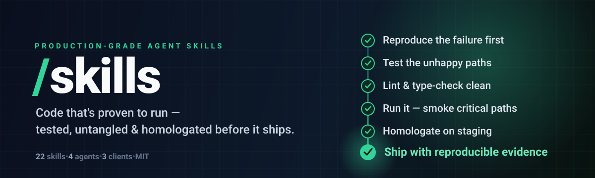

<div align="center">



<h3>Compact engineering skills with focused procedures and reproducible checks.</h3>

<p><strong>20 skills · 4 agents · 4 prompts</strong> for coding assistants that inspect first, change narrowly, and finish with evidence.</p>

</div>

## Why this exists

Generic skill catalogs often fail in two ways:

- Many narrow skills overlap and waste context.
- Broad skills contain generic advice, stale links, or no executable workflow.

This catalog uses 20 domain skills. Every skill has:

- Frontmatter limited to the fields the Agent Skills spec allows.
- A description that states what the skill does and when to use it.
- A short operational workflow.
- Conditional links to real local references.
- A concise completion checklist.
- A maximum of 1000 words in `SKILL.md`.
- [Routing evals](.agents/evals/README.md) proving the description reaches the
  prompts it owns and loses the prompts it does not.

## Install

```bash
# Everything
npx skills add juninmd/skills --all

# Inspect available skills
npx skills add juninmd/skills --list

# Install one domain
npx skills add juninmd/skills --skill diagnostics
```

The repository also works as a VS Code/Copilot plugin or as an `.agents` directory:

```bash
git submodule add https://github.com/juninmd/skills .agents
```

## Skill Catalog

<!-- skill-catalog:start -->
| Skill | Use it for |
|---|---|
| `agent-engineering` | agent loops, MCP tools, context window pruning, parallel subagents, concurrent workspaces, headless resilience, and radar digests |
| `backend-systems` | NestJS, FastAPI, REST/GraphQL contracts, endpoints, controllers, pnpm, uv, async handlers, cache invalidation, EF Core, Pydantic, and backend builds |
| `cloud-devops` | GitHub Actions, Dockerfiles, Terraform, Helm, manual GHCR rollout, deployment sync drift, and safe bash/PowerShell |
| `code-simplification` | code reviews, collapsing abstractions, characterization tests, undocumented legacy recovery, bug sweeps, and deleting dead code |
| `codebase-mapping` | onboarding to a new repository, getting a quick map of an unfamiliar repo, package structure, and data flow |
| `data-engineering` | PostgreSQL, MySQL, Redis, schema migrations, zero-downtime DDL, pandas profiling, query plans, indexes, and aggregation |
| `dev-loop` | autonomous dev loop execution, stage handoffs, vertical slicing, prototype variants, and task tracking |
| `documentation` | README, docs verification, Mermaid diagrams as code, ASCII figures, terminal figures, code snippet images, PDF/DOCX generation, and OpenAPI reference |
| `frontend-engineering` | React, Next.js, Vite, Tailwind, WCAG accessibility, visual hierarchy, color palettes, anti-slop styling, UI states, and masonry |
| `git-workflow` | branches, rebase, reflog, stash, conflict resolution, PR drafting, conventional commit verification, version bumping, changelogs, and release tags |
| `goldsrc-modding` | Valve 220 .map geometry, ZHLT/VHLT compile pipelines, BSP30 lump editing, and CS 1.6 entity logic |
| `mobile-engineering` | mobile UI, lifecycle, navigation, permissions, offline behavior, accessibility, device integration, tests, and builds |
| `observability` | structured logging, metrics, distributed tracing, alerting, root-cause troubleshooting, postmortems, network failures, timeouts, and on-call response |
| `performance-engineering` | endpoint profiling, latency bottlenecks, N+1 query bottlenecks, memory leaks, LCP/INP web vitals, autonomous metric loops, and rightsizing costs |
| `project-lifecycle` | PRDs, vague requests, acceptance criteria, backlog triage, session handoffs, AGENTS.md authoring, interactive human wizards, and session learnings |
| `security-ops` | CVE scans, Gitleaks remediation, zero-trust reviews, plugin vetting, least privilege, threat modeling, and third-party extension safety |
| `software-architecture` | module boundaries, domain glossaries, repository layout, Electron multi-process security, ADRs, and circular dependency resolution |
| `test-engineering` | unit/integration tests, Vitest, pytest, flaky test elimination, Playwright E2E, LLM gateway conformance, and test coverage |
| `tooling-dev` | CLI arguments, exit codes, non-interactive execution, config discovery, signals, structured output, packaging, and integration tests |
| `web-research` | multi-source search, HTML table/listing scraping, verifying latest library stable versions, changelog tracking, and citations |
<!-- skill-catalog:end -->

## Skill Example

```yaml
---
name: diagnostics
description: |
  Reproduce and isolate software, test, performance, and network failures. Use for bugs, regressions, flaky tests, DNS, HTTP, TLS, timeouts, and root-cause analysis.
---
```

The description is the discovery signal. The body loads only after the skill is selected.

## Quality Contract

[`AGENTS.md`](./AGENTS.md) defines the shared operating contract:

- SecOps before QA, QA before DevOps, DevOps before SWE.
- Read before write.
- Minimum, surgical changes.
- Reproduce bugs before fixing.
- No destructive Git, database, or infrastructure operations without confirmation.
- No claim of completion without lint, scoped tests, and a smoke check.

## Validate

```bash
pnpm install --frozen-lockfile
pnpm run validate
pnpm run docs:build
```

`pnpm run validate` checks:

- Plugin manifest and referenced directories.
- Skill name/folder consistency.
- YAML-parsed frontmatter limited to `name` and `description`.
- Useful description and valid skill name.
- `## Checklist` presence.
- 1000-word skill budget.
- 1024-character description limit (Agent Skills spec).
- Local reference links and no orphan reference files.
- Linked topic maps for large reference collections.
- Routing evals: every skill has positive and negative prompts, wins the ones it
  owns, never steals a sibling's, is reachable at all, and no two descriptions
  collide. Ratcheted at 95% rank-1 (`pnpm run evals` for the report).
- Token budgets: tier-1 catalog ≤ 5100 tokens with a ≤ 100-token ceiling per
  description, each `SKILL.md` ≤ 1650 tokens (`pnpm run tokens:report` for the
  full breakdown). The catalog grows by adding skills, never by fattening
  descriptions.
- Generated README catalog consistency.
- Validator unit tests.

## Layout

```text
.
├── plugin.json
├── AGENTS.md
├── .agents/
│   ├── agents/
│   ├── evals/
│   ├── prompts/
│   ├── skills/
│   └── tools/
└── docs/
```

## Contributing

1. Add or update `.agents/skills/<name>/SKILL.md`.
2. Keep `name` equal to the folder.
3. State what the skill does and when to use it in `description`.
4. Link detailed material from `references/`; do not duplicate it in `SKILL.md`.
5. Add `.agents/evals/<name>.json` with at least 3 positive and 2 negative prompts.
6. Run `pnpm run catalog:generate` after adding or renaming a skill.
7. Run `pnpm run validate` and `pnpm run docs:build`.

## License

MIT.
compare https://github.com/msitarzewski/agency-agents