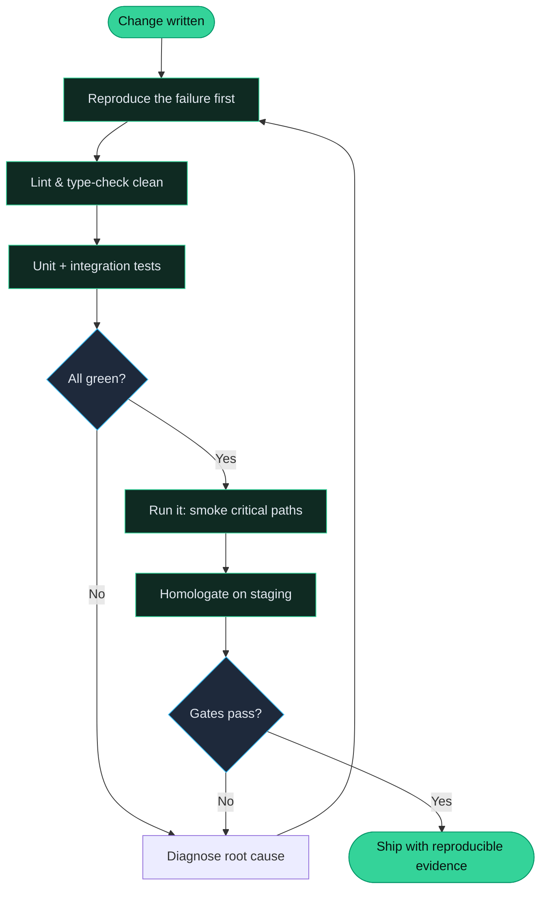
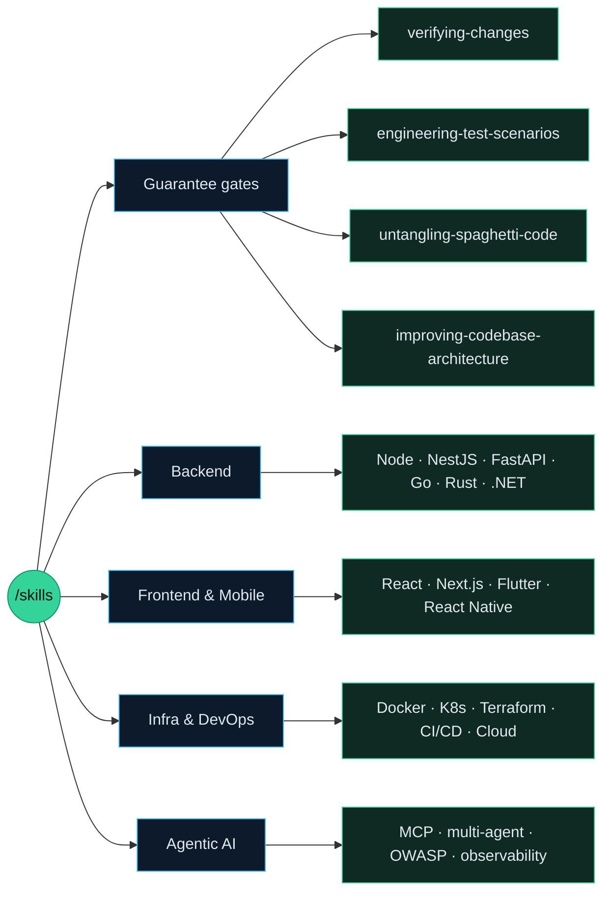

<div align="center">


<h3>AI coding skills that don't just write code — they prove it works.</h3>

<p><strong>86 skills · 4 agents · 21 rules · 4 prompts</strong> that turn a generic AI assistant into a disciplined engineer who reproduces failures, tests the unhappy paths, untangles spaghetti, and refuses to say <em>“done”</em> without reproducible evidence.</p>

<p>


</p>

<p>
<a href="https://code.visualstudio.com/docs/copilot/customization/agent-plugins"></a>
<a href="https://docs.github.com/en/copilot/reference/copilot-cli-reference/cli-plugin-reference"></a>


</p>

</div>

---

## Why this exists

Generic AI assistants are fast — and they happily hand you code that compiles, demos once, and falls apart in production. The recurring failure modes are always the same:

| Generic AI output | What it actually means |
|---|---|
| “It compiles.” | …but nobody ran it. Runtime is untested. |
| “Here are some tests.” | …happy path only. Null, timeout, race, and error paths are absent. |
| “Done.” | …no homologation, no acceptance gate, no reproducible proof. |
| “Refactored.” | …same spaghetti, new variable names. Complexity untouched. |

This repository fixes that at the source. Each skill is a compact, battle-tested playbook that forces senior-engineer behaviour **before** code is written, **while** it changes, and **before** anything is called done.

### The guarantee, not just advice

These skills converge on one contract: **a change is not finished until it is proven.** That contract is the same loop an agent runs every time:



---

## The four guarantees

Four skills were built specifically to kill the failure modes above. They cross-link into the rest of the library, so invoking one pulls in the right specialists automatically.

| Guarantee | Skill | What it enforces |
|---|---|---|
| **It runs** | [`verifying-changes`](.agents/skills/verifying-changes/SKILL.md) | A six-rung verification ladder — compile → unit → integration → smoke/run → homologation → evidence. Never reports “done” without a reproducible artifact. |
| **The unhappy paths are tested** | [`engineering-test-scenarios`](.agents/skills/engineering-test-scenarios/SKILL.md) | For every happy path, 3–5 deliberate failure scenarios: boundaries, nulls, errors, races, timeouts, fault injection, abuse cases — each asserting exact error **and** unchanged state. |
| **No spaghetti** | [`untangling-spaghetti-code`](.agents/skills/untangling-spaghetti-code/SKILL.md) | Detect by complexity thresholds, lock behaviour with characterization tests, then untangle one reversible move at a time. |
| **Real architecture** | [`improving-codebase-architecture`](.agents/skills/improving-codebase-architecture/SKILL.md) | Evidence-first module boundaries, deeper interfaces, decoupled tests, ADRs for decisions that matter. |

> [!NOTE]
> These four don't replace your test runner or linter — they orchestrate them. `verifying-changes` invokes `engineering-test-scenarios` when coverage gaps appear; `untangling-spaghetti-code` calls `verifying-changes` for fail-to-pass proof on every step.

---

## Before / after

What the same request produces with and without the skills installed:

```text
#  Without skills
$  "add a money transfer endpoint"
   → one happy-path handler
   → one test: transfers $50 successfully
   → "Done."

#  With /engineering-test-scenarios + /verifying-changes
$  "add a money transfer endpoint"
   → handler + guard clauses
   → tests: $0, overdraft, null recipient, DB timeout,
            concurrent double-spend (invariant: balance >= 0)
   → reproduced each failure, ran the suite twice (deterministic)
   → evidence: test log + run output attached
```

---

## What's inside



---

## Quick install

> [!TIP]
> **Recommended:** the Skills CLI works for Claude Code, Copilot CLI, and any assistant that reads `.agents/`.

```bash
# Everything
npx skills add juninmd/skills --all

# Preview the catalog without installing
npx skills add juninmd/skills --list

# Just one skill
npx skills add juninmd/skills --skill verifying-changes
```

<details>
<summary><strong>Other install paths</strong> — VS Code plugin · Copilot CLI · git submodule</summary>

<br>

**VS Code Agent Plugin**

1. Enable `chat.plugins.enabled`.
2. Run `Chat: Install Plugin From Source`.
3. Use `https://github.com/juninmd/skills`.

```jsonc
// Use this repo as a marketplace
{ "chat.plugins.marketplaces": ["juninmd/skills"] }
```

**Copilot CLI**

```bash
copilot plugin install juninmd/skills
```

**Git submodule (any assistant reading `.agents/`)**

```bash
git submodule add https://github.com/juninmd/skills .agents
```

</details>

### Try it

```text
/verifying-changes          # prove the change runs before "done"
/engineering-test-scenarios # design the failure paths, not just happy ones
/untangling-spaghetti-code  # measure complexity, then refactor safely
/developing-node            # Node 24 + TypeScript best practices
/mastering-docker           # production-ready, distroless, non-root images
/code-reviewer              # principal-level multi-perspective review
```

---

## Capability catalog

The full library, grouped. The four guarantee skills are marked ⭐.

<details open>
<summary><strong>Testing &amp; Verification</strong></summary>

| Skill | What you get |
|---|---|
| ⭐ `verifying-changes` | Verification ladder; reproduce-before-fix; homologation gates; evidence as the definition of done |
| ⭐ `engineering-test-scenarios` | Boundary / null / error / concurrency / timeout / fault-injection / abuse scenario design |
| `test-driven-development` | Red/green/refactor with vertical slices; tests encode intent |
| `generative-testing` | Property-based, mutation, and fuzz testing; >80% mutation kill rate |
| `contract-testing` | OpenAPI 3.1, Pact consumer-driven contracts, breaking-change detection |
| `vitest` | Vitest unit testing, Jest-compatible API |

</details>

<details>
<summary><strong>Code Quality &amp; Architecture</strong></summary>

| Skill | What you get |
|---|---|
| ⭐ `untangling-spaghetti-code` | Complexity thresholds, characterization tests, one-move-at-a-time refactoring |
| ⭐ `improving-codebase-architecture` | Module boundaries, deep interfaces, ADRs, testability |
| `applying-clean-code` | Naming, function size, abstraction levels, guard clauses |
| `applying-design-principles` | SOLID, DRY, KISS, YAGNI refactoring |
| `auditing-code` · `ai-code-review` | Static analysis, code smells, AI-assisted diff review |
| `diagnosing-bugs` | Evidence-driven debugging for defects, flaky behaviour, regressions |
| `validating-typescript` · `typescript-advanced-types` | Strict type safety; branded types, conditional & mapped types |
| `performance-profiling` | Flame graphs, memory/CPU profiling, query and load analysis |
| `karpathy-guidelines` · `audit-context-building` | Avoid common LLM coding mistakes; line-by-line vulnerability context |

</details>

<details>
<summary><strong>Backend &amp; API</strong></summary>

| Skill | Stack |
|---|---|
| `developing-node` | Node 24 · TypeScript · pnpm · Biome · Vite 8 |
| `developing-nestjs` | NestJS modular, validation, auth |
| `developing-fastapi` | FastAPI · Pydantic v2 · async |
| `developing-python` · `modern-python` | uv · ruff · ty · pyproject.toml |
| `developing-go` · `developing-rust` · `developing-dotnet` | Go modules · Rust ownership · .NET + EF Core |
| `administrating-databases` · `database-migrations` | PostgreSQL/MongoDB/Redis · zero-downtime schema evolution |
| `managing-vector-databases` | Vector DBs for similarity search and RAG |

</details>

<details>
<summary><strong>Frontend, UI &amp; Mobile</strong></summary>

| Skill | Stack |
|---|---|
| `react-dev` · `nextjs-dev` | React 19+ · Server Components · App Router · Turbopack |
| `frontend-design` · `frontend-craftsmanship` | Distinctive production UI; performance & accessibility review |
| `shadcn-ui` · `developing-ui-ux-components` · `vite` · `vitepress` | Component systems, build config, docs sites |
| `vercel-composition-patterns` | Server/Client boundaries, streaming, Server Actions |
| `flutter-dev` · `react-native-dev` · `android-native-dev` · `ios-application-dev` | Flutter+Riverpod · Expo · Jetpack Compose · SwiftUI |
| `implementing-accessibility` | WCAG standards and auditing |

</details>

<details>
<summary><strong>Infrastructure, DevOps &amp; Security</strong></summary>

| Skill | What you get |
|---|---|
| `mastering-docker` | Multi-stage, distroless, non-root, healthchecks |
| `managing-helm-charts` · `managing-iac` · `managing-serverless` | Helm · Terraform/Pulumi/Ansible · Lambda/Vercel/Workers |
| `managing-cloud-infrastructure` | Resilient architecture on AWS, GCP, Azure |
| `configuring-ci-cd` · `github-actions-docs` | GitHub Actions / GitLab CI pipelines |
| `security-scanning` · `zero-trust-architecture` | CVE/secrets/SBOM scanning; OIDC, mTLS, attestation |
| `observability-patterns` | Structured logs, distributed tracing, SLI/SLO |
| `firebase-apk-scanner` · `fix-gitleaks` | APK misconfig scanning; secret-leak triage |

</details>

<details>
<summary><strong>Agentic AI &amp; MCP</strong></summary>

| Skill | What you get |
|---|---|
| `developing-ai-agents` | Autonomous agents, tool calling, context management |
| `orchestrating-multi-agent-systems` | LangGraph / CrewAI selection, composition patterns, cost |
| `agent-security-owasp` | OWASP LLM Top 10, prompt-injection defence, HITL gates |
| `agent-context-and-memory` | 1M-token context lifecycle, pruning, RAG memory |
| `agent-observability-and-testing` | ReAct-loop tracing, tool isolation, LLM-as-judge |
| `type-safe-agent-tools` | Branded types, schema inference, discriminated state |
| `developing-mcp-servers` · `mcp-builder` | Model Context Protocol servers, end-to-end |

</details>

<details>
<summary><strong>Tooling, Git &amp; Workflow</strong></summary>

| Skill | What you get |
|---|---|
| `pnpm` · `tsdown` · `cli-development` · `developing-tooling` | Workspaces, library bundling, modern CLIs, automation |
| `using-git-worktrees` · `git-cleanup` · `finishing-a-development-branch` | Parallel worktrees; safe cleanup; merge/PR cycle |
| `executing-plans` · `spec-first-design` · `github-triage` · `gh-cli` | Plan execution, validated specs, issue triage |
| `documentation-extraction` · `trailmark-summary` | Docs-as-code; quick codebase summaries |
| `diagnosing-networks` · `diagnosing-rabbitmq` | DNS/HTTP troubleshooting; queue/DLQ diagnosis |
| `reviewing-skills` · `caveman` · `vscode-auto-update` | Skill auditing; terse mode; editor upkeep |

</details>

> Browse every skill in [`SKILLS.md`](./SKILLS.md) or the [documentation site](#documentation).

---

## Agents

Four principal-level assistants, each with a clear lane.

| Agent | Use it when | It answers |
|---|---|---|
| `code-reviewer` | Before merging a PR/MR | “Unhandled edge cases? Security risks? Dead code? Regressions?” |
| `principal-engineer` | Designing a system or weighing trade-offs | “What's the right boundary, the ADR, the scalability path?” |
| `devops-engineer` | CI/CD, containers, cloud, IaC | “How does this build, ship, scale, and stay observable?” |
| `plan-specialist` | Scoping non-trivial work | “What's the decomposition, the risk register, the quality gates?” |

---

## Rules &amp; the quality contract

[`AGENTS.md`](./AGENTS.md) is the operating contract every skill inherits — it makes the assistant act like a senior engineer with guardrails, not autocomplete.

| The contract enforces | In practice |
|---|---|
| **Clear judgment** | State assumptions, ask when unclear, push back on risky or overbuilt paths |
| **Small diffs** | Touch only required files; every changed line maps to the request |
| **Simplicity first** | No speculative features, premature abstractions, or needless configurability |
| **Verified work** | Lint, scoped tests, and a smoke check run before “done” |
| **Safety by default** | No destructive commands, no secret exposure, no git mutations without confirmation |

On top of that, **21 always-on rules** apply to every task — including `security`, `testing`, `error-handling`, `naming-conventions`, `observability`, `data-privacy`, `git-workflow`, `dockerfile-standards`, and per-stack standards (`typescript`, `python`, `nodejs`, `nestjs`, `frontend`, `mobile-react-native`).

<details>
<summary>All 21 rules</summary>

`code-design-principles` · `coding-standards` · `context-efficiency` · `data-privacy` · `dependencies` · `dockerfile-standards` · `documentation-standards` · `env-secrets` · `error-handling` · `frontend-standards` · `git-workflow` · `mobile-react-native-standards` · `naming-conventions` · `nestjs-standards` · `nodejs-standards` · `observability` · `python-standards` · `security` · `shell-ci` · `testing` · `typescript-standards`

</details>

---

## Layout

```text
.
├── plugin.json                      # VS Code / Copilot plugin manifest
├── AGENTS.md                        # the quality contract every skill inherits
├── .github/plugin/marketplace.json  # marketplace metadata
├── .agents/
│   ├── agents/                      # 4 custom agents
│   ├── prompts/                     # 4 reusable prompt templates
│   ├── rules/                       # 21 always-on standards
│   ├── skills/                      # 86 domain skills
│   └── tools/                       # validation scripts
└── docs/                            # VitePress documentation
```

## Validate

```bash
pnpm install
pnpm run validate     # checks plugin metadata + every agent/skill file
```

---

## Contributing

Contributions are welcome — especially:

- **New quality gates** — lint rules, test patterns, verification recipes.
- **New stacks** — a language, framework, or platform that isn't covered yet.
- **Domain expertise** — fintech, healthcare, ML, embedded.
- **Failing cases** — a real example where an AI assistant ships broken code is a great issue.

1. Fork, then add your skill/agent/rule under `.agents/`.
2. Match the existing frontmatter format (`name`, `description` with `USE FOR` / `DO NOT USE FOR` / `INVOKES`).
3. Run `pnpm run validate`.
4. Open a PR explaining when the customization should activate.

## Documentation

```bash
pnpm install
pnpm docs:dev     # then open http://localhost:5173
```

---

## License

MIT — free to use, fork, and adapt.

<div align="center">
<br>
Maintained by <a href="https://github.com/juninmd">Antonio Junior</a> · built for engineers who make AI prove its work.
</div>
