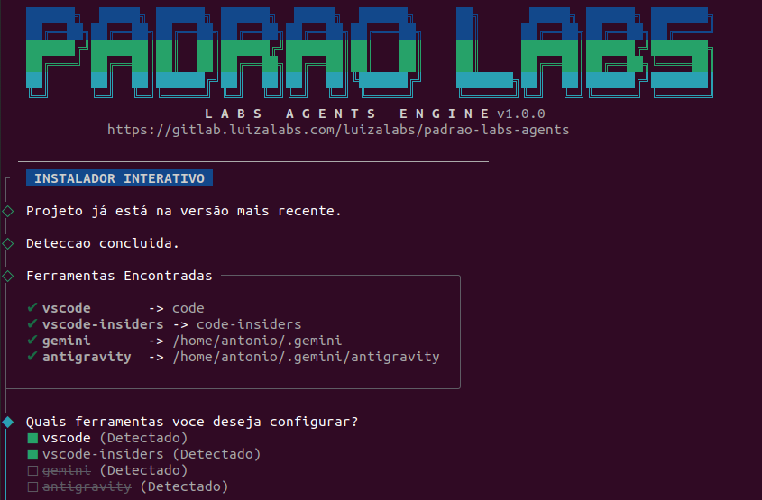
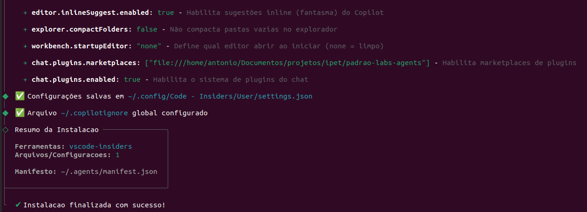
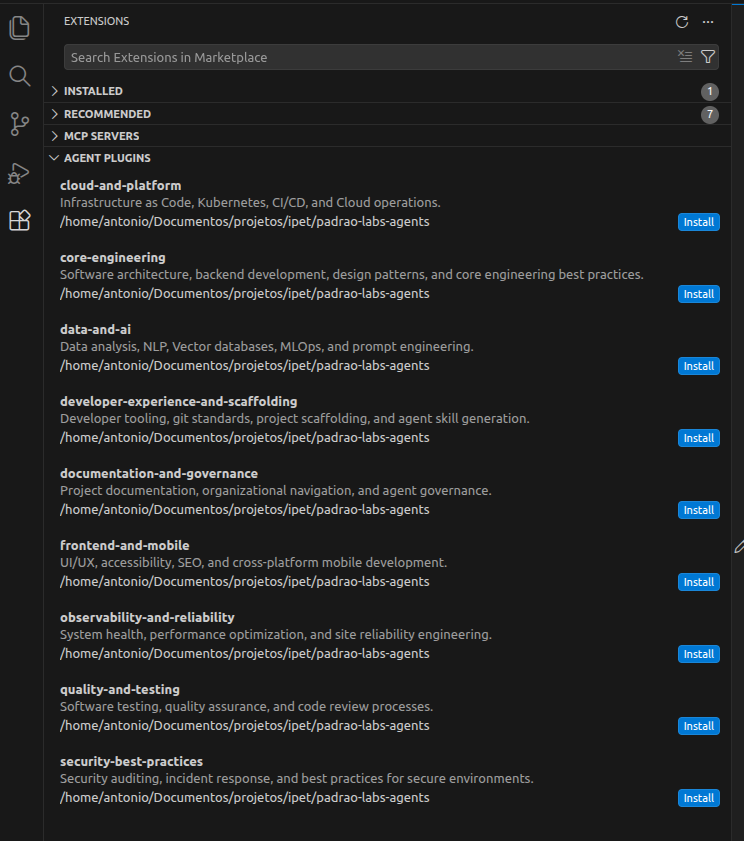
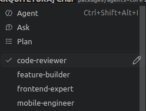
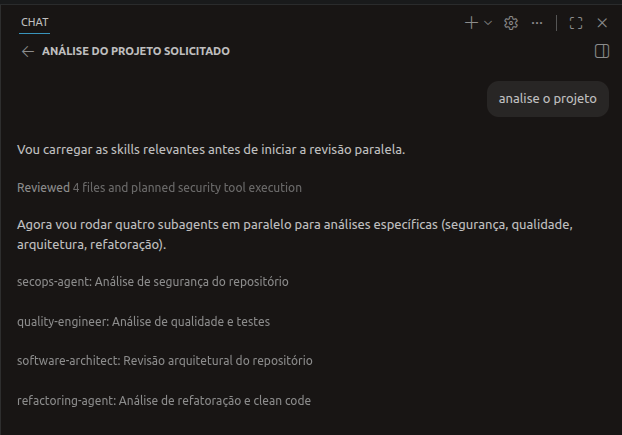
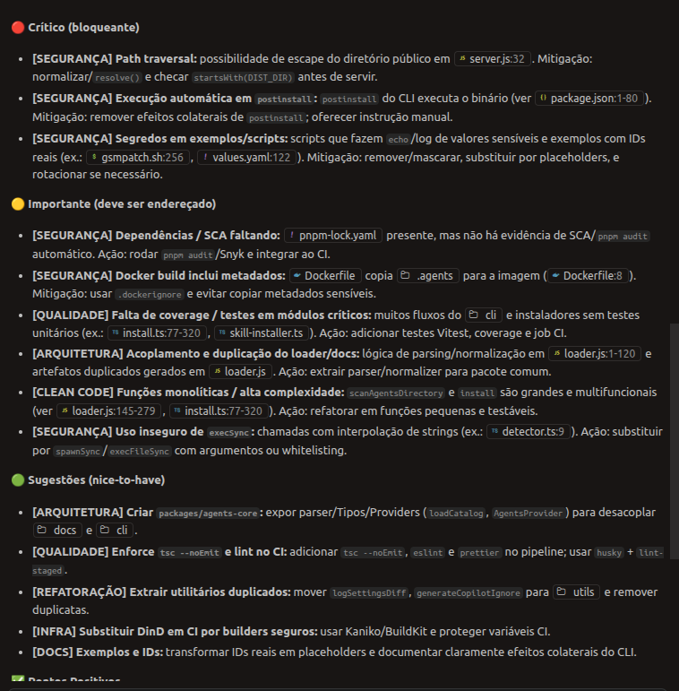

# 🤖 Catálogo de Agentes e Skills Luizalabs

[](https://padrao-labs-agents.luizalabs.com/)



Uma plataforma completa de documentação e descoberta para padrões de desenvolvimento da Luizalabs, configurações de agentes de IA, skills, regras e fluxos de trabalho.

## 📚 O que está incluído

- **65+ Skills** - Capacidades e padrões de desenvolvimento reutilizáveis. A especificação padrão para as skills segue [https://agentskills.io/specification](https://agentskills.io/specification).
- **Agentes** - Configurações de IA para GitHub Copilot, Antigravity, Gemini e mais.
- **Regras** - Padrões de desenvolvimento, diretrizes de segurança e melhores práticas.
- **Workflows** - Pipelines de CI/CD e automação de deploy.
- **Plugins** - Organização contextual para agentes e skills (padrão Agent Plugins).

## 🔤 Nomenclaturas e Conceitos

Dependendo da ferramenta de IA utilizada, os conceitos deste repositório podem aparecer com nomes diferentes:

| Conceito neste Repositório | VS Code (GitHub Copilot) | Google Antigravity / Gemini |
| :--- | :--- | :--- |
| **Agente (Agent)** | Chat Participant / Agent | Custom Agent / Persona |
| **Subagente (Subagent)** | Subagent / Tool Call | Delegate Agent / Sub-Persona |
| **Skill** | Tool / Action / Skill | Skill / Tool |
| **Regras (Rules)** | Custom Instructions | System Instructions / Constitution |
| **Workflow** | Procedure / Plan | Workflow / Action Plan |











## Dica

> git config --global http.sslVerify false

Ative temporariamente para evitar problemas na VPN ao clonar o repositório

## Instalação Direta Manual Remota - VSCode

```json
{
  "chat.plugins.marketplaces": [
    "ssh://git@gitlab.luizalabs.com/luizalabs/padrao-labs-agents.git",
  ]
}
```
## 📦 CLI - Instalação Automatizada e Uso

### 🌐 Instalação Recomendada (via Git Clone)

Para garantir que você sempre tenha a versão mais recente e possa customizar as ferramentas, recomendamos clonar o repositório e linkar o binário globalmente:

```bash
# 1. Clone o repositório
git clone git@gitlab.luizalabs.com:luizalabs/padrao-labs-agents.git
cd padrao-labs-agents

# 2. Instale as dependências e faça o build
pnpm install
pnpm run build

# 3. Link o comando globalmente
cd cli
npm link
```

Após esses passos, o comando `padrao-labs-agents` estará disponível no seu terminal.

### 🚀 Configuração Inicial (Setup)

Configure seu ambiente (VS Code/Insiders) com um único comando:

```bash
padrao-labs-agents install
```

Este comando irá:
1. Verificar atualizações no seu repositório local.
2. Detectar instalações do VS Code e VS Code Insiders.
3. Configurar os caminhos de regras, agentes e skills (via Agent Plugins ou Symlinks).

#### Outros Comandos Disponíveis

```bash
padrao-labs-agents install --tools vscode  # Instala apenas para o VS Code Stable
padrao-labs-agents init                    # Inicializa um projeto novo com arquivos padrão (sonar, dependency.yaml)
padrao-labs-agents cron                    # Gerencia o agendamento de auto-update
```

#### Mapa de Instalação Global por Ferramenta

| Ferramenta          | Diretório Global         | agentes | skills | regras | workflows |
| ------------------- | ------------------------ | :-----: | :----: | :----: | :-------: |
| **VS Code**         | `~/.agents/`             |    ✅    |   ✅    |   ✅    |     -     |
| **VS Code Insiders**| `~/.agents/`             |    ✅    |   ✅    |   ✅    |     -     |

> O CLI detecta automaticamente quais ferramentas estão instaladas no sistema e instala apenas para elas.

#### 🔄 Auto-Update Automático (Cron)

O CLI registra **automaticamente** um job de cron durante a instalação, mantendo suas configurações de agentes sempre atualizadas.

| Detalhe     | Valor                                             |
| ----------- | ------------------------------------------------- |
| **Horário** | Segunda a Sexta, 09:00                            |
| **Comando** | `padrao-labs-agents update`                       |
| **Log**     | `~/.agents/cron.log`                             |

```bash
# Verificar se está ativo
crontab -l | grep padrao-labs

# Remover o auto-update (não recomendado)
padrao-labs-agents cron --remove
```

> **CI/CD:** O cron é ignorado automaticamente em ambientes com `CI`, `GITLAB_CI`, `GITHUB_ACTIONS`, etc.
> **Sem crontab:** Em sistemas sem suporte a cron (Windows, Docker), um aviso é exibido e a instalação continua normalmente.

### 🎯 Instalar Skills Individuais

Instale skills específicas do repositório GitLab com um único comando:

```bash
# Sintaxe
padrao-labs-agents skill install <skill-name>

# Exemplos
padrao-labs-agents skill install applying-yagni
padrao-labs-agents skill install applying-dry
padrao-labs-agents skill install applying-solid
padrao-labs-agents skill install applying-kiss
padrao-labs-agents skill install applying-clean-code
```

#### ⚙️ Como Funciona o Cache

- **Repositório Local**: O CLI identifica automaticamente a pasta onde você clonou o projeto.
- **Symlinks**: Cada skill cria um symlink local apontando para o arquivo original no seu repositório.
- **Eficiência**: Instalações são instantâneas e ocupam quase zero de espaço extra (~4 KB por skill).

#### 📍 Localização das Skills Instaladas

```text
~/.agents/skills/
├── applying-yagni/ → <seu-repositorio-clonado>/.agents/skills/applying-yagni/
├── applying-dry/   → <seu-repositorio-clonado>/.agents/skills/applying-dry/
└── ...
```

### 🔌 Plugins Externos (Remotos)

Você pode estender o catálogo adicionando skills e agentes de repositórios externos (GitHub/GitLab). Para isso, adicione a configuração do plugin em `plugins/external.json`.

**Exemplo de configuração (Dataverse):**

```json
{
  "name": "dataverse",
  "description": "Build and manage Microsoft Dataverse solutions using natural language. Includes table/column creation, solution lifecycle, data operations, and MCP server configuration.",
  "version": "1.0.0",
  "author": {
    "name": "Microsoft",
    "url": "https://www.microsoft.com"
  },
  "homepage": "https://github.com/microsoft/Dataverse-skills",
  "keywords": ["dataverse", "power-platform", "microsoft", "mcp", "python", "sdk"],
  "license": "MIT",
  "repository": "https://github.com/microsoft/Dataverse-skills",
  "source": {
    "source": "github",
    "repo": "microsoft/Dataverse-skills",
    "path": ".github/plugins/dataverse"
  }
}
```

Após adicionar o plugin ao arquivo, execute `pnpm run build` para sincronizar e gerar o novo catálogo.

#### 📖 Documentação Detalhada

Para mais informações sobre a arquitetura e funcionamento, consulte os arquivos no diretório `.agents/`.

### 💻 Uso Local em Desenvolvimento

Se você quiser testar alterações da CLI antes de publicá-la, siga os passos abaixo:

1. Clone o repositório:

```bash
git clone https://gitlab.luizalabs.com/luizalabs/padrao-labs-agents.git
cd padrao-labs-agents
```

2. Instale as dependências e faça o build:

```bash
pnpm install
pnpm run build
```

3. Entre na pasta da CLI e crie o link simbólico global:

```bash
cd cli
pnpm run build
npm link
```

4. Agora você pode usar o comando da CLI em qualquer lugar do seu terminal para testar:

```bash
padrao-labs-agents --help
padrao-labs-agents install --dry-run
padrao-labs-agents skill install applying-yagni
```

**Dica:** Para remover o link depois, execute `npm unlink -g padrao-labs-agents` dentro da pasta `cli`.

## 🏗️ Arquitetura

Este projeto está estruturado como um **Monorepo** moderno usando `pnpm workspaces`.

```text
padrao-labs-agents/
├── .agents/          ← 🌟 FONTE DA VERDADE (SOMENTE LEITURA para consumidores)
│   ├── agents/
│   ├── skills/       (65+ itens)
│   ├── rules/
│   └── workflows/
├── apps/
│   └── docs/         ← Site de Documentação VitePress
├── cli/              ← Pacote CLI NPM (@luizalabs/padrao-labs-agents)
├── plugins/          ← 🔌 Agent Plugins (Organização Contextual)
├── package.json      ← Raiz do Monorepo (Orquestração e Scripts Globais)
└── pnpm-workspace.yaml
```

## 🚀 Início Rápido (Desenvolvimento)

**Requisitos:**

- Node.js 18+
- pnpm 8+

```bash
# Instala as dependências para todos os workspaces
pnpm install

# Executa o site de documentação localmente (inicia em http://localhost:5173)
pnpm run dev

# Gera a build tanto do CLI quanto da Documentação
pnpm run build

# Executa os testes em todos os workspaces
pnpm run test
```

## 🧪 Testes

O monorepo utiliza o `vitest` com configurações otimizadas e isoladas para cada pacote.

```bash
pnpm test          # Executa todos os testes recursivamente
pnpm test:run      # Executa apenas uma vez (modo CI)
pnpm test:coverage # Gera relatório de cobertura
```

## 🔄 Como a Documentação Funciona

O projeto usa um script interno (`apps/docs/src/loader.js`) que, durante o processo de build ou dev:

1. Escaneia a pasta raiz `.agents/`.
2. Extrai metadados e conteúdos dos arquivos Markdown.
3. Gera a estrutura do VitePress **sem duplicar arquivos reais** na raiz do projeto.
4. Cria o catálogo pesquisável (`catalog.json`).

## ✍️ Contribuindo

- **Nova Skill ou Regra?** Adicione ou modifique arquivos **APENAS** dentro da pasta raiz `.agents/`.
- **Novo Plugin?** Adicione ou modifique arquivos **APENAS** dentro da pasta `plugins/`.
- **Alterar o site?** Modifique os componentes em `apps/docs/`.
- **Alterar o CLI?** Modifique o código em `cli/src/`.
