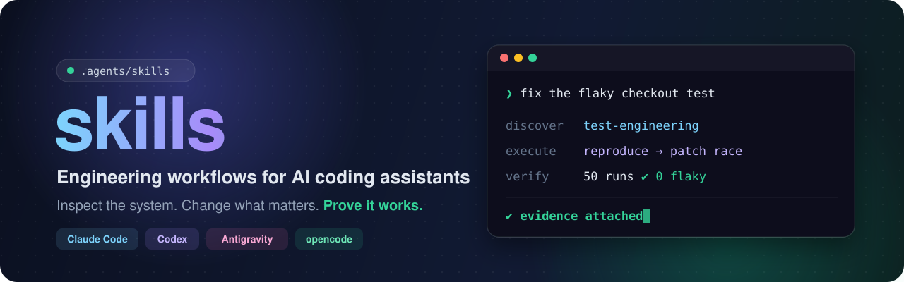
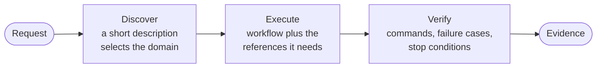
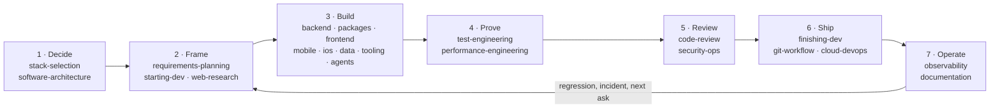

<div align="center">



# Engineering Skills · Evidence First

[](https://github.com/juninmd/skills/actions/workflows/validate.yml)
[](https://github.com/juninmd/skills/actions/workflows/security.yml)
[](./LICENSE)
[](#claude-code-plugin)
[](https://agentskills.org)
[](https://modelcontextprotocol.io)

**30 skills · 4 agents · enterprise operating instructions**

*Production engineering workflows for AI coding assistants: discover intent, execute surgical changes, and prove with reproducible evidence.*

[🧭 Skill catalog](#skill-catalog) · [🚀 Get started](#get-started) · [📐 Lifecycle cycle](#where-each-skill-fits-in-the-cycle) · [📜 Standards](#specifications-and-standards) · [🛡️ Quality checks](#quality-checks) · [🤝 Contributing](#contributing)

</div>

---

## From request to evidence



Each skill covers a whole domain instead of a single trick. Its main workflow stays short; detailed procedures live beside it in `references/` and load only when the task needs them.

<table>
<tr>
<td width="33%" valign="top">

**🧭 Routed, not recited**

A one-line description picks the domain. No instruction file has to name a skill for it to load.

</td>
<td width="33%" valign="top">

**📦 Loaded on demand**

Short workflows up front, deep references beside them. Token budgets are enforced in CI.

</td>
<td width="33%" valign="top">

**✅ Done means proven**

Workflows end in a check you run: a test, a smoke command, or an explicit stop condition.

</td>
</tr>
</table>

## Get started

Pick **one** install method per client.

| Method | Clients | Stays in sync with the repo | Includes agents and instructions |
|---|---|---|---|
| [Symlink install](#symlink-install) | Claude Code, Codex, Antigravity, opencode | yes, live | instructions and configs |
| [Claude Code plugin](#claude-code-plugin) | Claude Code | after `marketplace update` and reinstall | agents |
| [Skills CLI](#skills-cli) | any client the CLI supports | no, files are copied | no |

### Symlink install

One canonical checkout, linked into every client. Edits in the repo are live everywhere; nothing is copied.

```bash
git clone https://github.com/juninmd/skills && cd skills
node .agents/tools/install.mjs --dry-run   # show the plan
node .agents/tools/install.mjs all         # or: claude | codex | agy | opencode
```

| Client | Skills | Instructions | Config |
|---|---|---|---|
| Claude Code | `~/.claude/skills/<name>` | `~/.claude/CLAUDE.md` | `~/.claude/settings.json` |
| Codex | `~/.codex/skills/<name>` | `~/.codex/AGENTS.md` | `~/.codex/config.toml` |
| Antigravity (agy) | `~/.gemini/config/skills/<name>` | `~/.gemini/GEMINI.md` | — |
| opencode | `~/.config/opencode/skills/<name>` | — | — |

> [!NOTE]
> Instruction files link to [`.agents/AGENTS.md`](.agents/AGENTS.md); configs link to [`.agents/clients/`](.agents/clients/), tuned for low token use. Existing real files are renamed to `*.bak-<timestamp>` first. Pass `--no-config` to link skills and instructions only.

<details>
<summary><b>What the installer changes, and Windows specifics</b></summary>

<br/>

- Configs are tuned for low token use: collapsed skill listings, bounded tool output, 1h prompt cache, auto-compact.
- Links to retired skills are pruned on every run.
- On Windows, skill directories become junctions, which need no privilege. File links need Developer Mode or an elevated shell. Without either, `CLAUDE.md` and `GEMINI.md` get a one-line `@path` import stub that tracks the repo the same way, and the config files are left untouched until you rerun elevated.

</details>

### Claude Code plugin

Installs all skills and the 4 agents as one plugin (`juninmd:<name>`). The marketplace is [`.claude-plugin/marketplace.json`](.claude-plugin/marketplace.json); the plugin root is `.agents/`.

```bash
claude plugin marketplace add juninmd/skills            # or a local checkout path
claude plugin install juninmd@skills                    # --scope user | project | local
claude plugin details juninmd@skills                    # inventory and always-on token cost
```

> [!IMPORTANT]
> Claude Code copies plugins into `~/.claude/plugins/cache`. To pick up repo edits, run `claude plugin marketplace update skills` and reinstall. Updates follow the default branch unpinned, so read the diff before updating.

Claude Code uses one install method at a time. While `juninmd@skills` is installed, `install.mjs claude` removes the skill links that point into this repo and skips creating new ones, so no skill loads twice. To switch back, run `claude plugin uninstall juninmd@skills`, then `node .agents/tools/install.mjs claude`.

### Skills CLI

```bash
npx skills add juninmd/skills --list                    # inspect the catalog
npx skills add juninmd/skills --skill backend-systems   # copy one domain
```

The CLI copies files; it does not track the repo or install the agents and operating instructions.

## Pick a starting point

| | Your task | Start with |
|---|---|---|
| 🧭 | Understand an unfamiliar repository or clarify a request | [starting-dev](.agents/skills/starting-dev/SKILL.md) |
| 🛠️ | Build a service or endpoint | [backend-systems](.agents/skills/backend-systems/SKILL.md) |
| 🎨 | Build an accessible web interface | [frontend-engineering](.agents/skills/frontend-engineering/SKILL.md) |
| 🔎 | Investigate failures and incidents | [observability](.agents/skills/observability/SKILL.md) |
| 🧐 | Review a change or simplify code | [code-review](.agents/skills/code-review/SKILL.md) |
| 🔐 | Audit credentials and trust boundaries | [security-ops](.agents/skills/security-ops/SKILL.md) |
| 🚢 | Ship a finished branch as a PR | [finishing-dev](.agents/skills/finishing-dev/SKILL.md) |

## Where each skill fits in the cycle

You never invoke a skill by name: a one-line description routes the request. What
follows is *when* each domain owns the work, so you can tell whether the right one
picked up the task, and name it yourself when it did not.



| Stage | You are about to | Skill | It leaves behind |
|---|---|---|---|
| **1 · Decide** | Pick a language, runtime, framework, database, or replace a dependency | [`stack-selection`](.agents/skills/stack-selection/SKILL.md) | The pick, the rejected alternative, and the condition that reverses it |
| | Draw module boundaries, a domain model, or an ADR | [`software-architecture`](.agents/skills/software-architecture/SKILL.md) | Boundaries and dependency directions |
| **2 · Frame** | Turn a vague ask into acceptance criteria, a PRD, a finish line, or vertical slices | [`requirements-planning`](.agents/skills/requirements-planning/SKILL.md) | Criteria you can test against |
| | Onboard to an unfamiliar repo, write AGENTS.md, run the research-prototype-plan loop | [`starting-dev`](.agents/skills/starting-dev/SKILL.md) | A map of the codebase and a plan |
| | Verify a claim, a version, or prior art before committing to it | [`web-research`](.agents/skills/web-research/SKILL.md) | Cited, dated evidence |
| **3 · Build** | Write a service, endpoint, or background job | [`backend-systems`](.agents/skills/backend-systems/SKILL.md) | Working code and its contract |
| | Add, upgrade, or migrate packages, lockfiles, pnpm workspaces, or uv projects | [`package-management`](.agents/skills/package-management/SKILL.md) | A reproducible install and a clean lockfile |
| | Write web UI, components, or layout | [`frontend-engineering`](.agents/skills/frontend-engineering/SKILL.md) | An accessible, state-complete interface |
| | Write a mobile screen or device integration | [`mobile-engineering`](.agents/skills/mobile-engineering/SKILL.md) | A screen that survives lifecycle and permissions |
| | Write Swift, SwiftUI, UIKit, Metal, or WidgetKit code | [`ios-engineering`](.agents/skills/ios-engineering/SKILL.md) | Native code that follows the platform guidelines |
| | Write queries, schema, or migrations | [`data-engineering`](.agents/skills/data-engineering/SKILL.md) | A reversible migration and a checked query plan |
| | Build a CLI, generator, or internal automation | [`tooling-dev`](.agents/skills/tooling-dev/SKILL.md) | A non-interactive tool with honest exit codes |
| | Build agents, MCP servers, or their system prompts | [`agent-engineering`](.agents/skills/agent-engineering/SKILL.md) | Tool schemas, bounded loops, and a failure matrix |
| | Fan work out to subagents, verify their claims, or run a long unattended task | [`agent-orchestration`](.agents/skills/agent-orchestration/SKILL.md) | Per-unit evidence and a task file |
| | Write, split, or tune a skill and its routing evals | [`skill-authoring`](.agents/skills/skill-authoring/SKILL.md) | A skill that wins its own prompts |
| **4 · Prove** | Add or repair tests, eliminate a flake | [`test-engineering`](.agents/skills/test-engineering/SKILL.md) | A test that fails for the right reason |
| | Chase latency, memory, Core Web Vitals, or spend | [`performance-engineering`](.agents/skills/performance-engineering/SKILL.md) | Before and after against a budget |
| **5 · Review** | Review a diff adversarially, or simplify working code | [`code-review`](.agents/skills/code-review/SKILL.md) | Findings with file, line, and impact |
| | Audit secrets, permissions, dependencies, trust boundaries | [`security-ops`](.agents/skills/security-ops/SKILL.md) | The threat surface and the safer fix |
| **6 · Ship** | Prepare and open the pull request with its evidence | [`finishing-dev`](.agents/skills/finishing-dev/SKILL.md) | A PR body carrying screenshots and payloads |
| | Rebase, recover a commit, resolve a conflict, tag a release | [`git-workflow`](.agents/skills/git-workflow/SKILL.md) | A verified remote SHA |
| | CI, containers, infrastructure, rollout | [`cloud-devops`](.agents/skills/cloud-devops/SKILL.md) | A pipeline and a rollback path |
| **7 · Operate** | Instrument, read a trace, diagnose an incident | [`observability`](.agents/skills/observability/SKILL.md) | Log, metric, alert, runbook |
| | Write the README, diagram, or API reference the change requires | [`documentation`](.agents/skills/documentation/SKILL.md) | Docs that match the shipped behavior |

Six skills sit outside the cycle and load whenever their subject appears:
[`radar-ia`](.agents/skills/radar-ia/SKILL.md) for AI ecosystem digests,
[`bot-engineering`](.agents/skills/bot-engineering/SKILL.md) for scheduled scraper and notification bots,
[`3d-models`](.agents/skills/3d-models/SKILL.md) and [`threejs`](.agents/skills/threejs/SKILL.md)
for 3D assets and scenes, [`goldsrc-modding`](.agents/skills/goldsrc-modding/SKILL.md),
and [`agy-image-babysitter`](.agents/skills/agy-image-babysitter/SKILL.md).

Every skill body opens with a **Not this skill** line naming the neighbors that own
the work it does not. When a handoff is wrong, that line is where to look first.

### One request, end to end

```text
"I need a screen showing each customer's orders"
  starting-dev           who reads it, what counts as an order, what success is
  stack-selection        TanStack Query is already here; no new dependency
  data-engineering       index on (customer_id, created_at), query plan checked
  backend-systems        GET /v1/customers/:id/orders, paginated, validated at the edge
  frontend-engineering   loading, empty, error, and offline states
  test-engineering       a test that fails without the index and passes with it
  code-review            defects and contract regressions
  security-ops           can one customer read another one's orders?
  finishing-dev          a PR with a screenshot per state and the endpoint payload
  observability          a latency metric and an alert on the new endpoint
```

Each step is a handoff the skills make themselves: a workflow ends by naming the
domain that owns what comes next. You keep writing prose.

## Skill catalog

<!-- skill-catalog:start -->
| Skill | Use it for |
|---|---|
| `3d-models` | Blender cleanup, VRM 0.x/1.0 conversion, VRoid exports, MToon materials, shape keys, ARKit blendshapes, humanoid rigs, and VRM SpringBone hair physics |
| `agent-engineering` | agent loops, tool schemas, step and token bounds, prompt-injection defense, tool guards and hooks, MCP transports, context pruning, and system prompts for Claude 5 models |
| `agent-orchestration` | fan-out subagents in isolated workspaces, dynamic workflows, adversarial verification, tournaments, model councils, stop rules with a task file, and headless runs through auth expiry and quotas |
| `agy-image-babysitter` | Keep an agy (Antigravity CLI) conversation generating images unattended: relaunch the headless loop 90s after a 401 token expiry and sleep until quotaResetTimeStamp after a 429 |
| `backend-systems` | NestJS modules, DI, DTO validation, FastAPI, REST/GraphQL OpenAPI contracts, endpoints and controllers, async concurrency, and cache invalidation |
| `bot-engineering` | dedupe/seen-state, rate-limit backoff, keyless endpoints, CronJob scheduling, Telegram/Discord/WhatsApp delivery, and optional LLM steps |
| `cloud-devops` | GitHub Actions, Dockerfiles, Terraform, Helm, manual GHCR rollout, deployment sync drift, and safe bash/PowerShell |
| `code-review` | adversarial review, sibling bug variants, legacy code recovery, characterization tests, simplifying working code, and deleting proven dead code |
| `data-engineering` | PostgreSQL, MySQL, Redis, schema migrations, zero-downtime DDL, query plans, indexes, pandas profiling, and aggregation |
| `documentation` | README, docs verification, Mermaid diagrams as code, ASCII and terminal figures, code snippet images, PDF/DOCX generation, and OpenAPI reference |
| `finishing-dev` | review-before-PR delivery, PR descriptions, homologação/homologar (prove it works on the real target), and acceptance evidence |
| `frontend-engineering` | React, Next.js, Vite, Tailwind, WCAG accessibility, visual hierarchy, color palettes, anti-slop styling, UI states, and masonry |
| `git-workflow` | branches, worktrees, rebase conflicts, reflog recovery, stash, bisect, conventional commits, semantic version bumps, changelogs, and release tags |
| `goldsrc-modding` | Valve 220 .map geometry, ZHLT/VHLT compiles, BSP30 lumps, CS 1.6 entities, and Pawn (.sma/.amxx) natives, forwards, precache, and crash forensics |
| `ios-engineering` | Swift optionals, concurrency and memory, SwiftUI views, UIKit and Auto Layout, Metal shaders, WidgetKit, iOS permissions and system integration, and App Store readiness |
| `mobile-engineering` | React Native, Expo, Flutter, and native Android UI, lifecycle, navigation, permissions, offline behavior, accessibility, localization, device integration, tests, and builds |
| `observability` | structured logging, metrics, distributed tracing, alerting, root-cause troubleshooting, postmortems, network failures, timeouts, and on-call response |
| `package-management` | pnpm workspaces, catalogs, overrides, patches, and peer deps; uv, pyproject.toml, PEP 723 scripts, Ruff, prek/pre-commit, Dependabot update PRs, lockfile hygiene, and CI install caching |
| `performance-engineering` | endpoint profiling, bottlenecks, N+1 queries, memory leaks, LCP/INP, autonomous metric loops, and rightsizing costs |
| `radar-ia` | the daily AI radar and best-posts digests; not for one-paper research or debugging |
| `requirements-planning` | acceptance criteria, PRDs and specs, agent briefs with finish lines, vertical-slice backlog issues, and triage of incoming issues |
| `security-ops` | end-to-end vulnerability audits, pen tests, CVE scans, Gitleaks remediation, zero-trust reviews, least privilege, threat modeling, and plugin or MCP server vetting |
| `skill-authoring` | a new SKILL.md, gotchas sections, progressive-disclosure references, skill scripts and persistent data, splitting a skill that straddles domains, and deciding whether a recurring task deserves a skill |
| `software-architecture` | module boundaries, ubiquitous language and CONTEXT.md glossaries, repository layout, Electron multi-process security, ADRs, and circular dependencies |
| `stack-selection` | TypeScript, Bun versus Node, pnpm, uv, NestJS, Biome, Scalar versus Swagger, an LLM SDK, Tauri versus Electron, picking a package manager, framework, ORM, or linter, and adopting or replacing a dependency |
| `starting-dev` | AGENTS.md or CLAUDE.md project instructions and README, onboarding by charting an unfamiliar codebase and its dependencies, the dev loop (research, throwaway prototype variants, plan, implement), worktrees, task stages, and session handoffs |
| `test-engineering` | unit and integration tests, Vitest, pytest, Playwright E2E, flaky test elimination, LLM gateway conformance, and coverage |
| `threejs` | GLTF/GLB model viewers, cameras, lighting, raycasting, shaders, animation, WebGL/WebGPU rendering, asset loading, scene performance, and GPU resource cleanup |
| `tooling-dev` | CLI arguments, exit codes, non-interactive execution, config discovery, signals, structured output, packaging, and integration tests |
| `web-research` | multi-source search, HTML table and listing scraping, latest stable library versions, changelog tracking, and citations |
<!-- skill-catalog:end -->

## Beyond skills

| Resource | Purpose |
|---|---|
| [Specialist agents](.agents/agents/) | Code review, planning, principal engineering, and DevOps roles |
| [Shared operating instructions](.agents/AGENTS.md) | Hats, confirmation table, rules, validation gates, and the final report format |
| [Client configs](.agents/clients/) | Token-optimized `settings.json` (Claude Code) and `config.toml` (Codex) |
| [Repository contract](./AGENTS.md) | How to maintain and validate this catalog |

## Specifications and standards

This repository strictly conforms to official agent engineering specifications:

| Specification | Standard / Authority | Implementation in this repository |
|---|---|---|
| **Agent Skills** | [agentskills.org](https://agentskills.org) | Strict frontmatter schema (`name`, `description`, `metadata`, `compatibility`), progressive disclosure, and house structure (`Preflight`, `Workflow`, `Rules`, `Checklist`). |
| **Agent Hooks** | Claude Code & Runtime Hooks | Lifecycle interceptors (`PreToolUse` blocking, `PostToolUse` sanitization), deterministic barriers, and scoped tool matchers. |
| **Model Context Protocol** | [modelcontextprotocol.io](https://modelcontextprotocol.io) | Typed JSON schemas for tools, URI-identified resources, structured prompts, and fail-closed circuit breakers. |

## Quality checks

From a checkout with Node.js and pnpm available:

```bash
pnpm install --frozen-lockfile
pnpm run validate
pnpm run docs:build
```

| Check | Evidence it provides |
|---|---|
| Structure | Valid frontmatter, skill names, required sections, and local references |
| Catalog | README and docs tables match the skill descriptions |
| Budgets | Descriptions and skill bodies stay within the configured limits |
| Routing | Offline lexical ranking of positive and negative prompts |
| Retired names | No skill or instruction still hands off to a merged skill by its old name |
| Approved domains | Every http(s) host a skill cites is listed, with a reason, in [`.agents/approved-domains.toml`](.agents/approved-domains.toml) |
| Documentation | Spelling, relative links, and a buildable documentation site |
| Validator tests | Regression checks for the validation tools |

> [!WARNING]
> Passing checks are necessary, but they do not prove assistant behavior. Routing uses a deterministic lexical scorer and does not run the target assistants. Exercise representative tasks in each client before claiming compatibility.

Inspect detailed reports with `pnpm run evals` and `pnpm run tokens:report`. Budget limits live in the validation tools rather than in a duplicated table here.

## Contributing

1. Edit the owning domain under `.agents/skills/<name>/`.
2. Keep the main workflow actionable; link specialist procedures from `references/`. Naming a sibling skill is optional; naming a retired skill is an error.
3. When merging or renaming, add the old name to `.agents/retired-skills.json`, then update callers, reference maps, eval owners, agents, and installation examples.
4. Add realistic positive prompts and negative prompts with their correct owner. Preserve failing cases when fixing descriptions.
5. Regenerate the catalog with `pnpm run catalog:generate`, then run the quality checks above.

Keep one canonical skill tree. Client adapters link or package that source without creating independently maintained copies.

## License

[MIT](./LICENSE). Preserve source attribution and third-party license notices when redistributing references.
