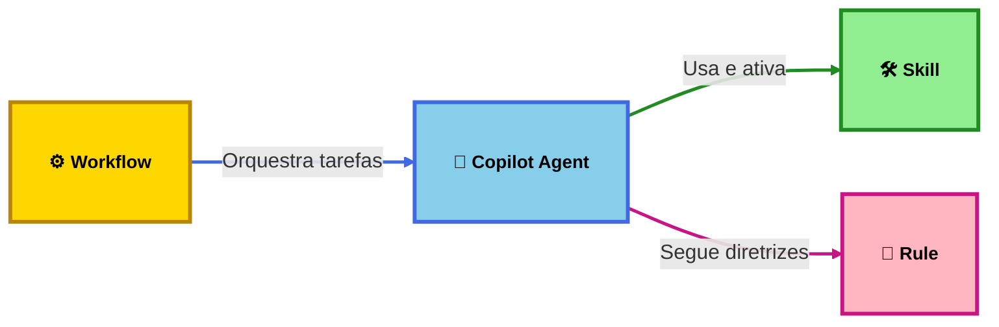

  

    <strong>Requisito:</strong> Voce precisa ter o <strong>Node.js</strong> (versao 18 ou superior) instalado no seu computador.
  

  

    <strong>Como instalar o Node.js:</strong> Acesse <a href="https://nodejs.org" target="_blank" rel="noopener">nodejs.org</a>, baixe a versao <strong>LTS</strong> (recomendada) e siga o instalador. Apos a instalacao, abra o terminal e digite <code>node --version</code> para confirmar.
  

  <h3 style="margin-top: 0; margin-bottom: 1.5rem; font-size: 1.3rem; color: var(--vp-c-brand); font-weight: 600;">Instale via CLI para comecar</h3>
  

    Cole o comando abaixo no seu terminal (Prompt de Comando, PowerShell ou Terminal do Mac/Linux) e pressione Enter:
  

  

    <code class="clone-command" style="background: transparent; padding: 0; font-size: 1rem; font-weight: 500; color: var(--vp-c-text-1); flex: 1; font-family: 'Monaco', 'Menlo', 'Ubuntu Mono', monospace; user-select: all;">git clone git@gitlab.luizalabs.com:luizalabs/padrao-labs-agents.git && cd padrao-labs-agents && npm i && npm link .</code>
    <button class="copy-clone-btn" style="background: var(--vp-c-brand); color: white; border: none; padding: 0.75rem 1.25rem; border-radius: 8px; cursor: pointer; font-weight: 600; font-size: 0.95rem; transition: all 0.3s ease; white-space: nowrap; display: flex; align-items: center; gap: 0.5rem; flex-shrink: 0;">
      📋
      Copiar
    </button>
  

<CategoryCards />

  

    

      <h2>Instalacao Global via CLI</h2>
      

        Instale todas as skills, agents, rules e workflows globalmente no Visual Studio Code com GitHub Copilot usando um unico comando.
      

      

        <code style="font-size: 0.95rem;">padrao-labs-agents install</code>
      

      

        Outros comandos: <code>init</code> (padroniza repo), <code>cron</code> (auto-update diario), <code>update</code> (atualiza para latest).
        Veja o guia completo em <a href="/getting-started">Primeiros Passos</a>.
      

    

    

      

        
📦

        

          <strong>VS Code & Copilot</strong>
          
Apoio total às extensões de IA no ambiente VS Code.

        

      

      

        
🔄

        

          <strong>Auto-Update</strong>
          
Cron diario mantém tudo na versao mais recente.

        

      

      

        
🚀

        

          <strong>Init de Repositorio</strong>
          
Gera arquivos de configuração essenciais para o seu projeto.

        

      

    

  

  

    

      <h2>O que é uma Skill?</h2>
      

        Uma <strong>Skill</strong> é um pacote modular de instruções, scripts e recursos prontos para IA que estendem as capacidades do seu GitHub Copilot.
      

      

        Pense nela como um "plugin" para suas interações com LLMs, fornecendo conhecimento específico de domínio, padrões de uso de ferramentas e fluxos de trabalho automatizados que garantem o seguimento dos padrões de engenharia da Luizalabs.
      

    

    

      

        
📦

        

          <strong>Estrutura Padronizada</strong>
          
Uma única fonte da verdade para o seu editor.

        

      

      

        
🛠️

        

          <strong>Recursos Prontos para Uso</strong>
          
Scripts e arquivos de configuração integrados.

        

      

      

        
✅

        

          <strong>Melhores Práticas</strong>
          
Validado pelo time de Engenharia Core.

        

      

    

  

  

    

      

        
🛡️

        

          <strong>Contexto Persistente</strong>
          
Diretrizes sempre ativas para o modelo.

        

      

      

        
🎯

        

          <strong>Ativação Seletiva</strong>
          
Acionado por @menções no Copilot Chat.

        

      

    

    

      <h2>O que são Regras?</h2>
      

        <strong>Regras</strong> são restrições ou diretrizes definidas manualmente que fornecem contexto persistente e reutilizável para o Copilot no <strong>nível do prompt</strong>.
      

      

        Enquanto Skills são conhecimentos "puxados" sob demanda, Regras ditam como o agente deve pensar e se comportar em todas as interações — impondo estilos de código específicos, padrões de arquitetura ou fundamentos de segurança.
      

    

  

  

    

      

        
⚙️

        

          <strong>Fluxos de Trabalho</strong>
          
Automatize sequências complexas de tarefas.

        

      

      

        
🔀

        

          <strong>Orquestração</strong>
          
Coordene tarefas pelo Copilot.

        

      

    

    

      <h2>O que são Workflows?</h2>
      

        <strong>Workflows</strong> são sequências automatizadas de tarefas que combinam múltiplas skills, regras e o Copilot para resolver problemas complexos de forma coordenada.
      

      

        Diferentemente de uma skill individual, um workflow orquestra uma série de passos interdependentes, como analisar código, executar testes, fazer deploy e monitorar resultados - tudo em uma sequência lógica e automatizada.
      

    

  

  <h2 style="text-align: center; margin-bottom: 1rem; font-size: 1.8rem;">Estrutura Hierárquica</h2>
  
Como Workflows, Agents, Skills, e Rules se relacionam

  

  

