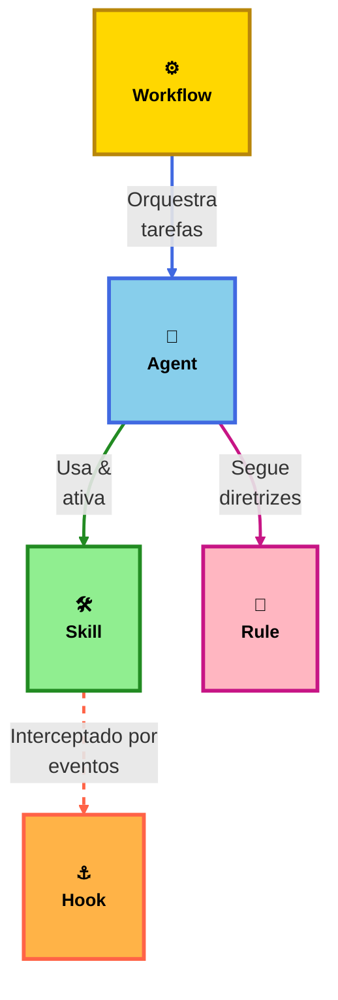

  <h3 class="clone-title">🚀 Clone o repositório para começar</h3>
  <code class="clone-command">git clone git@gitlab.luizalabs.com:luizalabs/padrao-labs-agents.git</code>

  

    <h4 class="quick-link-title">📚 Documentação</h4>
    <ul class="quick-link-list">
      <li class="quick-link-item"><a href="/docs/getting-started.html">→ Getting Started</a></li>
      <li class="quick-link-item"><a href="/docs/agentic-concepts.html">→ Conceitos Agentic</a></li>
      <li class="quick-link-item"><a href="/docs/agents/index.html">→ Catálogo de Agentes</a></li>
    </ul>
  

  

    <h4 class="quick-link-title">🛠️ Recursos</h4>
    <ul class="quick-link-list">
      <li class="quick-link-item"><a href="/docs/deploy.html">→ Deploy & CI/CD</a></li>
      <li class="quick-link-item"><a href="/docs/skills/index.html">→ Todas as Skills</a></li>
      <li class="quick-link-item"><a href="/docs/rules/index.html">→ Regras & Padrões</a></li>
    </ul>
  

  <h2 style="text-align: center; margin-bottom: 1rem; font-size: 2rem; font-weight: 700;">Explore o Catálogo</h2>
  
Navegue por Agentes, Skills, Regras, Hooks e Workflows

  <CategoryCards />

  

    

      <h2>🛠️ O que é uma Skill?</h2>
      

        Uma <strong>Skill</strong> é um pacote modular de instruções, scripts e recursos prontos para IA que estendem as capacidades dos seus assistentes de IA.
      

      

        Pense nela como um "plugin" para suas interações com LLMs, fornecendo conhecimento específico de domínio, padrões de uso de ferramentas e fluxos de trabalho automatizados que garantem o seguimento dos padrões de engenharia da Luizalabs.
      

    

    

      

        
📦

        

          <strong>Estrutura Padronizada</strong>
          
Uma única fonte da verdade para todas as ferramentas.

        

      

      

        
🛠️

        

          <strong>Recursos Prontos para Uso</strong>
          
Scripts e arquivos de configuração integrados.

        

      

      

        
✅

        

          <strong>Melhores Práticas</strong>
          
Validado pelo time de Engenharia Core.

        

      

    

  

  

    

      

        
🛡️

        

          <strong>Contexto Persistente</strong>
          
Diretrizes sempre ativas para o modelo.

        

      

      

        
🎯

        

          <strong>Ativação Seletiva</strong>
          
Acionado por @menções ou padrões de arquivo.

        

      

      

        
📏

        

          <strong>Padrões Globais</strong>
          
Armazenados em GEMINI.md para uso entre workspaces.

        

      

    

    

      <h2>📋 O que são Regras?</h2>
      

        <strong>Regras</strong> são restrições ou diretrizes definidas manualmente que fornecem contexto persistente e reutilizável para o agente de IA no <strong>nível do prompt</strong>.
      

      

        Enquanto Skills são conhecimentos "puxados" sob demanda, Regras ditam como o agente deve pensar e se comportar em todas as interações — impondo estilos de código específicos, padrões de arquitetura ou fundamentos de segurança.
      

    

  

  

    

      <h2>⚓ O que são Hooks?</h2>
      

        <strong>Hooks</strong> são eventos de ciclo de vida síncronos que permitem interceptar, colocar ou aumentar o comportamento do agente durante seu loop de execução.
      

      

        Usando Hooks, você pode injetar scanners de segredos, impor políticas de segurança antes de uma ferramenta rodar, ou adicionar automaticamente contexto do repositório a cada requisição do modelo. Eles garantem que as ações da IA permaneçam seguras e em conformidade.
      

    

    

      

        
🔄

        

          <strong>Eventos de Ciclo de Vida</strong>
          
Interceptam BeforeTool, AfterModel e mais.

        

      

      

        
🔒

        

          <strong>Aplicação de Políticas</strong>
          
Bloqueiam ações perigosas programaticamente.

        

      

      

        
🔗

        

          <strong>Interface JSON</strong>
          
Compatibilidade universal via stdin/stdout.

        

      

    

  

  

    

      

        
👤

        

          <strong>Persona Isolada</strong>
          
Prompts de sistema dedicados para cada agente.

        

      

      

        
💾

        

          <strong>Eficiência de Tokens</strong>
          
Loops de contexto independentes economizam tokens principais.

        

      

      

        
🤝

        

          <strong>Delegação de Tarefas</strong>
          
Contrate "especialistas" para sub-tarefas complexas.

        

      

    

    

      <h2>🤖 O que são Subagentes?</h2>
      

        <strong>Subagentes</strong> são instâncias especializadas de IA que o agente principal pode "contratar" para realizar tarefas específicas e focadas com seu próprio conjunto de ferramentas e instruções.
      

      

        Ao delegar trabalho para um subagente, o agente principal pode lidar com problemas complexos de múltiplos estágios (como uma migração completa de código) sem sobrecarregar a janela de contexto da conversa principal.
      

    

  

  

    

      

        
⚙️

        

          <strong>Fluxos de Trabalho</strong>
          
Automatize sequências complexas de tarefas.

        

      

      

        
🔀

        

          <strong>Orquestração</strong>
          
Coordene múltiplas ferramentas e agentes.

        

      

    

    

      <h2>🔄 O que são Workflows?</h2>
      

        <strong>Workflows</strong> são sequências automatizadas de tarefas que combinam múltiplas skills, regras e agentes para resolver problemas complexos de forma coordenada.
      

      

        Diferentemente de uma skill individual, um workflow orquestra uma série de passos interdependentes, como analisar código, executar testes, fazer deploy e monitorar resultados - tudo em uma sequência lógica e automatizada.
      

    

  

  <h2 class="hierarchy-title">🏗️ Estrutura Hierárquica</h2>
  
Como Workflows, Agents, Skills, Rules e Hooks se relacionam em perfeita orquestração

  

  

  <InstallGuide />

